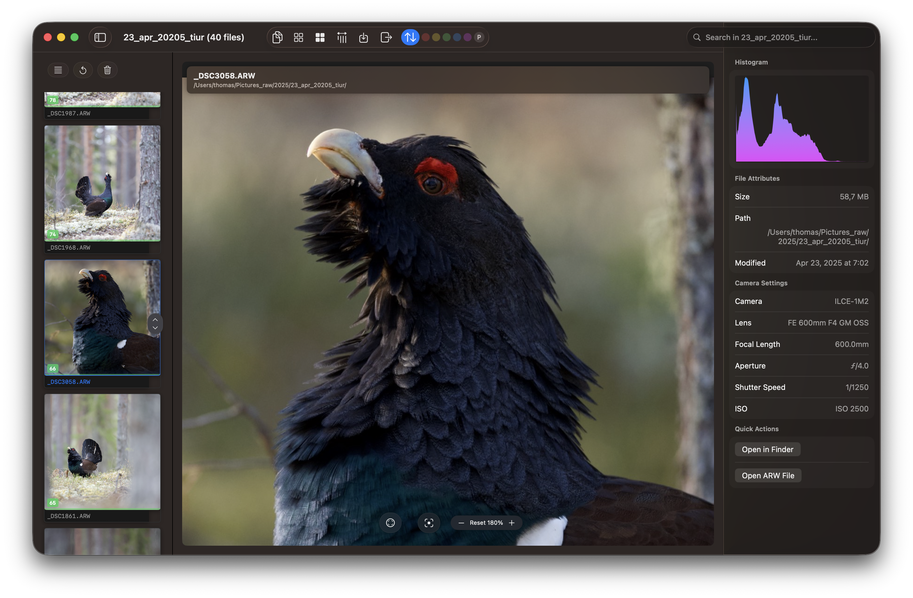
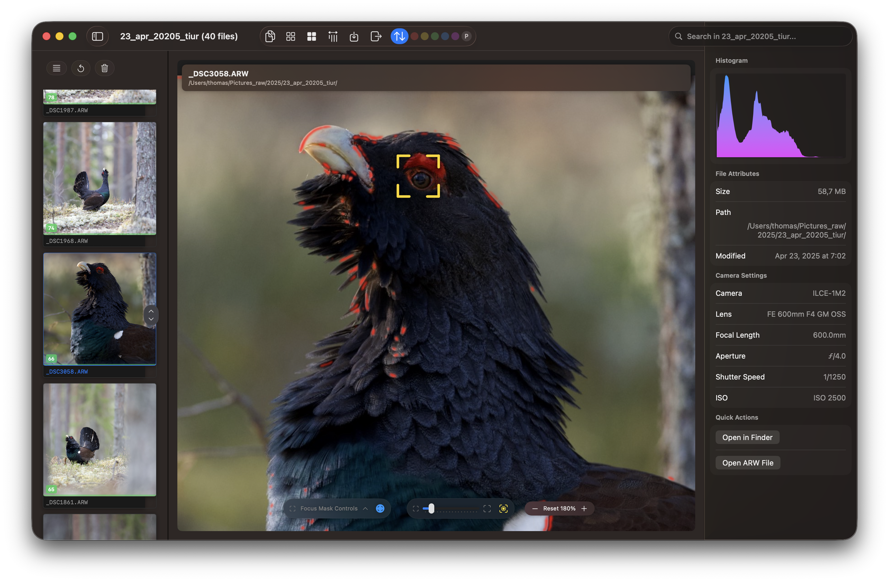

# RawCull

[](https://github.com/rsyncOSX/RawCull/blob/main/Licence.MD)

RawCull is a macOS photo review and culling application for Sony ARW RAW files, built exclusively for Apple Silicon. It combines GPU-accelerated analysis — EXIF extraction, focus point detection, sharpness scoring, and saliency — to help you quickly identify your best shots.

## Requirements

- macOS Sequoia or later
- **Apple Silicon** (M-series) only

## Installation

Install via Homebrew:

```bash
brew tap rsyncOSX/cask && brew install --cask rawcull
```

Or download from the [Apple App Store](https://apps.apple.com/no/app/rawcull/id6759362764?mt=12) or [GitHub Releases](https://github.com/rsyncOSX/RawCull/releases).

## Latest release

v1.8.9 — May 24, 2026 — in active development

## Camera body compatibility

Primary [Sony Fullformat, Nikon Fullformat](https://rawcull.netlify.app/docs/) is experimental.

## Documentation

- [User documentation](https://rawcull.netlify.app)
- [Release notes](https://rawcull.netlify.app/blog/)


Focus mask and focus point applied:



