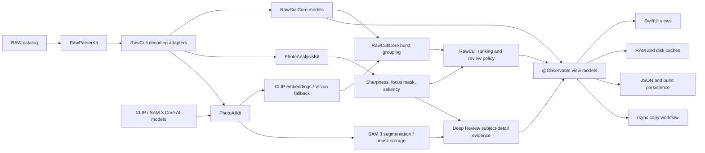

# RawCull

[](https://github.com/rsyncOSX/RawCull/blob/main/Licence.MD)

> [!IMPORTANT]
> **This is the AI-based version of RawCull.** The `main` and
> `version-3.0.0` branches require macOS 27, an Apple Silicon Mac, and Xcode 27
> to build. For macOS 26, use `version-2.3.4` or `version-2.3.3`.

RawCull is a native macOS photo review and culling application for Sony ARW RAW
files. It combines fast embedded-preview loading with focus-point extraction,
sharpness analysis, visual similarity, burst grouping, ratings, and selective
export.

The application is written in Swift 6 and SwiftUI. Focused Swift packages own
image parsing, analysis, AI inference, shared culling models, JSON encoding,
and rsync execution. RawCull owns application state, workflow, caching,
persistence, and presentation.

## Supported versions and requirements

| Branch | Minimum macOS | Development toolchain | Main characteristics |
|---|---:|---|---|
| `main`, `version-3.0.0` | macOS 27 | Xcode 27, Swift 6 | AI-based RawCull 3 with local CLIP semantic search and similarity, SAM 3 Deep Review, model validation, and Managed Background Assets support |
| `version-2.3.4` | macOS 26.2 | Xcode 26, Swift 6 | macOS 26 release line using built-in Vision feature prints for visual similarity and burst grouping |
| `version-2.3.3` | macOS 26.2 | Xcode 26, Swift 6 | Earlier macOS 26 release line, also using Vision feature prints rather than optional CLIP and SAM 3 models |

All versions require an Apple Silicon Mac. The main difference between the
macOS 26 and macOS 27 editions is the AI layer, not the basic photo-culling
workflow: the macOS 26 branches use Apple's built-in Vision feature prints,
whereas RawCull 3 adds local CLIP models for text-to-image search and optional
similarity analysis, plus SAM 3 subject segmentation for Deep Review. RawCull 3
falls back to Vision similarity when its selected CLIP model is unavailable.

RawCull 3 is not yet published as a prebuilt download; build this branch from
source until its macOS 27 release is available.

## Main capabilities

- Discover and scan supported RAW files in a selected catalog.
- Read EXIF metadata, dimensions, camera and lens information, ISO, and
  aperture.
- Extract normalized camera AF points from Sony MakerNotes.
- Display cached thumbnails, embedded full-size JPEG previews, or developed
  RAW previews.
- Render AF-point overlays and GPU-generated focus masks.
- Score image sharpness using full-frame, salient-subject, and AF-region
  evidence.
- Apply photo-type presets and fast, balanced, or high-precision scoring.
- Group visually similar neighboring frames into bursts and rank candidates
  with sharpness, similarity, confidence, and caution details.
- Search by natural-language description when a validated CLIP model is
  available.
- Run SAM 3 Deep Review to isolate a subject and recommend a burst winner.
- Tag, reject, or assign star ratings to selected images.
- Persist ratings, analysis results, burst decisions, and cache signatures.
- Export embedded or developed JPEG files.
- Copy tagged or rated RAW files with streaming rsync progress.
- Monitor thumbnail-cache usage and macOS memory-pressure events.

## Local AI features

RawCull's AI-assisted culling runs locally on Apple Silicon. Photos are not
uploaded to an external inference service.

### What the AI functions do

- **Similarity and burst grouping:** CLIP image embeddings, or Vision feature
  prints as the fallback, measure visual similarity and help group neighboring
  frames for comparison.
- **Semantic search:** CLIP compares a text-query embedding with cached image
  embeddings to rank photographs by meaning.
- **Sharpness and subject evidence:** PhotoAnalysisKit combines sharpness,
  saliency, classification, focus-mask, and camera AF-point evidence to rank
  candidates and explain cautions.
- **Deep Review:** SAM 3 isolates the subject, evaluates detail inside the
  mask, checks whether the AF point falls within the subject, and recommends a
  winner with confidence and supporting reasons. **Mark Winner & Close** saves
  the winner, gives it a three-star rating, and marks the burst reviewed.
- **Local caching:** Embeddings, masks, scores, and burst decisions are cached
  so compatible results can be reused in later sessions.

### CLIP and SAM 3

Both are trained neural networks, but they produce different evidence:

| | CLIP: vision-language encoder | SAM 3: vision-language segmentation |
|---|---|---|
| Question answered | “How well does this text match this image?” | “Where are the pixels belonging to this concept?” |
| Inputs | Image or text | Image plus text or visual prompt |
| Output | One fixed-length vector per image or text | Masks, boxes, presence, and confidence scores |
| Spatial information | Compresses most of the image into one vector | Preserves detailed spatial information |
| Training objective | Match related image-caption vectors | Detect and segment prompted objects |
| RawCull use | Search, similarity ranking, and burst grouping | Subject isolation and detailed review |

```text
CLIP

Image ── image encoder ──► vector ─┐
                                   ├─► similarity score
Text  ── text encoder  ──► vector ─┘

SAM 3

Image  ── image encoder ────────────┐
                                    ├─► detector + mask decoder ─► masks and boxes
Prompt ── text/visual encoder ──────┘
```

> CLIP determines **what an image is related to**; SAM 3 determines **where
> that thing is in the image**.

CLIP image encoding runs once per photograph. Later searches reuse the cached
image vectors and only run the text-query path; comparing cached vectors is
ordinary mathematical computation, not another neural-network pass. SAM 3
normally runs for each image and prompt, but RawCull can cache and reuse the
resulting subject mask.

### AI model requirements and setup

- Vision feature-print similarity is built into macOS and requires no model
  download.
- CLIP similarity supports validated, PhotoAIKit-compatible DataComp and
  OpenAI CLIP Core AI model bundles. RawCull uses the model selected in
  **Settings > AI** and falls back to Vision feature prints when it is missing
  or invalid. Semantic search requires a valid CLIP model.
- Deep Review requires a validated, PhotoAIKit-compatible SAM 3 Core AI model
  bundle and remains unavailable without one.
- Each bundle must contain `metadata.json`, the selected `.aimodel` or
  `.aimodelc` asset, and all resources declared by its manifest.
- Models are not bundled with RawCull. **Settings > AI > Download AI Models**
  provides the Managed Background Assets flow for licence review, download
  progress, cancellation, and removal. The current server address is a
  non-routable placeholder, and production downloads remain blocked until
  licence and provenance requirements are complete.
- The first use of a portable Core AI model can take longer while macOS
  specializes it for the current Mac.

Manual installation remains available while model distribution is blocked.
Install the resources, open **Settings > AI**, and select **Check Again** to
validate them. Standard non-sandboxed locations are:

```text
~/Library/Application Support/RawCull/Models/CLIP-DataComp/
~/Library/Application Support/RawCull/Models/CLIP-OpenAI/
~/Library/Application Support/RawCull/Models/SAM3/
```

Sandboxed builds use:

```text
~/Library/Containers/no.blogspot.RawCull/Data/Library/Application Support/RawCull/Models/CLIP-DataComp/
~/Library/Containers/no.blogspot.RawCull/Data/Library/Application Support/RawCull/Models/CLIP-OpenAI/
~/Library/Containers/no.blogspot.RawCull/Data/Library/Application Support/RawCull/Models/SAM3/
```

**Settings > AI** displays the exact expected paths. To enable CLIP, select
exactly one of **DataComp** or **OpenAI**, validate it, and enable **Use selected
CLIP model for similarity**. To use SAM 3, analyze a catalog into burst groups,
choose **Deep Review** on a burst, select the review target, and run the review.

See [Model asset packs](ModelAssets/README.md) for the release blockers,
licence and provenance catalogs, packaging steps, and hosting configuration.

## Architecture



RawCull keeps application-specific policy outside the packages:

- RAW source selection and decoding size
- security-scoped folder access
- settings and user preferences
- progress and cancellation presentation
- cache locations and file identity
- ratings, tagging, burst decisions, and the culling workflow

The imported packages own reusable parsing, sharpness analysis, AI inference,
model validation, similarity artifacts, segmentation, mask storage, domain
models, serialization, and process execution.

### Swift package dependencies

Requirements are pinned to exact versions or revisions in the Xcode project
and recorded in `Package.resolved`. The tables below mirror every resolved pin;
revision-pinned dependencies use the complete commit rather than an abbreviated
display value.

| Package (resolved identity) | Resolved pin | Responsibility | Main APIs used by RawCull |
|---|---:|---|---|
| [PhotoAIKit](https://github.com/rsyncOSX/PhotoAIKit) (`photoaikit`) | revision `2cb07d604beee3549df4d361a5d48b3e9506fb87` | AI contracts, validated Core AI resources, DataComp and OpenAI CLIP inference, SAM 3 inference, Vision fallback, segmentation workflows, and subject-mask storage | `CoreAICLIPProvider`, `CoreAISAM3Provider`, `VisionFeaturePrintBackend`, `SimilarityArtifactIndexer`, `SegmentationService`, `SubjectMaskSelector`, `SubjectMaskMemoryStore`, `SubjectMaskDiskStore` |
| [PhotoAnalysisKit](https://github.com/rsyncOSX/PhotoAnalysisKit) (`photoanalysiskit`) | `1.2.0` | Sharpness scoring, focus masks, Vision saliency and classification, calibration, batch analysis, and cache identity | `PhotoAnalyzer.analyzeBatch`, `PhotoAnalyzer.calibrate`, `PhotoAnalyzer.focusMask`, `PhotoAnalyzer.analyzeWithFocusMask`, `PhotoAnalyzer.sharpnessDescriptor`, `SharpnessPreset`, `SharpnessQuality` |
| [RawParserKit](https://github.com/rsyncOSX/RawParserKit) (`rawparserkit`) | `1.2.8` | RAW discovery, metadata parsing, embedded JPEG extraction, previews, and manufacturer MakerNote parsing | `RawFormatRegistry`, `RawImageLoader.metadata`, `thumbnailCGImage`, `thumbnail`, `previewImage`, `SonyMakerNoteParser`, `NikonMakerNoteParser`, `SupportedFileType` |
| [RawCullCore](https://github.com/rsyncOSX/RawCullCore) (`rawcullcore`) | `1.1.2` | Shared file, catalog, EXIF, burst-grouping, ranking, and review-state value types | `RawCullFileItem`, `RawCullSourceCatalog`, `ExifMetadata`, `BurstGroupingConfig`, `BurstGroupingEngine.group`, `BurstAnalysisResult`, `BurstCandidateScore`, `BurstReviewState` |
| [RsyncArguments](https://github.com/rsyncOSX/RsyncArguments) (`rsyncarguments`) | `1.0.0` | Type-safe construction of rsync and synchronization arguments | `Parameters`, `BasicRsyncParameters`, `OptionalRsyncParameters`, `SSHParameters`, `PathConfiguration`, `RsyncParametersSynchronize.argumentsForSynchronize`, `computedArguments` |
| [RsyncProcessStreaming](https://github.com/rsyncOSX/RsyncProcessStreaming) (`rsyncprocessstreaming`) | `1.0.0` | Starts and cancels rsync processes and streams file and progress output | `ProcessHandlers`, `RsyncProcess`, `executeProcess`, `cancel` |
| [ParseRsyncOutput](https://github.com/rsyncOSX/ParseRsyncOutput) (`parsersyncoutput`) | `1.0.0` | Parses rsync summaries into counts and formatted transfer statistics | `ParseRsyncOutput`, `getstats`, `numbersonly`, and the formatted file and size properties |
| [DecodeEncodeGeneric](https://github.com/rsyncOSX/DecodeEncodeGeneric) (`decodeencodegeneric`) | `1.0.0` | Generic Codable helpers for persistent JSON data | `DecodeGeneric.decodeArray`, `EncodeGeneric.encode` |

Resolved transitive dependencies are recorded here as release inputs even
though RawCull does not import their products directly:

| Resolved identity | Resolved pin | Role in the package graph |
|---|---:|---|
| `coreai-models` | revision `bffc38fe48f50e4e962ac9772b64a5b55a605286` | Apple Core AI model and conversion support reached through PhotoAIKit |
| `eventsource` | `1.4.1` | Server-sent-event transport support used transitively by model tooling |
| `swift-asn1` | `1.7.1` | ASN.1 support reached through the cryptography stack |
| `swift-atomics` | `1.3.1` | Low-level concurrency primitives used by transitive packages |
| `swift-collections` | `1.6.0` | Collection data structures used by transitive packages |
| `swift-crypto` | `4.5.1` | Cryptographic primitives used by transitive packages |
| `swift-huggingface` | `0.9.0` | Hugging Face model download and metadata support used by model tooling |
| `swift-jinja` | `2.4.2` | Prompt-template rendering used by model tooling |
| `swift-nio` | `2.101.3` | Networking and event-loop support used transitively |
| `swift-system` | `1.7.5` | System-call wrappers used transitively |
| `swift-transformers` | `1.3.3` | Tokenizer and transformer model support used by the AI package graph |
| `xgrammar` | revision `cee45aa95b8cdb5b16a8e11c037336870ec22369` | Grammar-constrained model tooling |
| `yyjson` | `0.12.0` | C JSON engine used by transitive model tooling |

## Workflows and package boundaries

### Catalog loading and RAW parsing

1. The user selects a security-scoped catalog.
2. `ScanFiles` discovers supported files through RawParserKit.
3. Metadata and AF information are read concurrently.
4. RawCullCore `FileItem` values are created and published to the main actor.
5. Ratings and compatible persisted analysis results are restored.

`RawParserKitImageLoader` adapts package results to RawCull:

- `RawImageLoader.metadata(for:)` becomes RawCullCore `ExifMetadata`.
- `RawImageLoader.thumbnailCGImage` feeds thumbnail caching, sharpness scoring,
  and feature generation.
- `RawImageLoader.thumbnail` supplies AppKit thumbnail images.
- `RawImageLoader.previewImage` supplies embedded full-size previews.
- MakerNote focus coordinates become normalized `CGPoint` values.

`RawFormatRegistry` handles supported-file discovery. Diagnostic tools also
call the Sony and Nikon MakerNote parsers directly to report embedded JPEG
locations and focus metadata.

### Thumbnail and preview loading

RawCull uses a two-tier thumbnail cache:

1. `SharedMemoryCache` provides the RAM layer through `NSCache`.
2. `DiskCacheManager` stores JPEG thumbnails below
   `~/Library/Caches/no.blogspot.RawCull/Thumbnails/`.
3. RawParserKit decodes a thumbnail when both caches miss.

Full-size embedded and developed previews use a separate disk cache. A
`DispatchSourceMemoryPressure` monitor lets RawCull reduce cache pressure while
keeping diagnostics available in the Memory Console.

### Sharpness and focus analysis

PhotoAnalysisKit owns the reusable focus and sharpness pipeline:

1. RawCull selects an embedded preview or a Core Image demosaiced RAW image.
2. `RawCullPhotoAnalysisAdapter` supplies asynchronous `PhotoAnalysisInput`
   providers.
3. `PhotoAnalyzer.analyzeBatch` performs bounded concurrent analysis and
   reports progress.
4. The package performs saliency, classification, Gaussian blur, Metal
   Laplacian analysis, regional scoring, and failure classification.
5. `SharpnessScoringModel` publishes scores, subject summaries, focus
   breakdowns, and estimated time to the UI.
6. `PhotoAnalyzer.calibrate` derives a visual focus threshold from a catalog
   or burst.
7. `PhotoAnalyzer.focusMask` and `analyzeWithFocusMask` render the focus overlay
   and its supporting evidence.

Each `PhotoAnalysisInput` carries ISO, aperture, and normalized AF position.
Photo-type and quality choices map to `SharpnessPreset` and
`SharpnessQuality`. Persistent results use
`PhotoAnalyzer.sharpnessDescriptor(for:)`, combined with RawCull's scoring
source, decoded size, source-file size, and modification date so stale results
are invalidated when the algorithm or input changes.

PhotoAnalysisKit does not know about `FileItem`, RAW formats, security-scoped
URLs, application settings, cache directories, or ratings.

### Similarity, semantic search, and Deep Review

RawCull imports six PhotoAIKit products: `PhotoAIContracts`,
`PhotoAIWorkflows`, `PhotoAIStorage`, `CoreAICLIPBackend`,
`CoreAISAM3Backend`, and `VisionFeaturePrintBackend`.

- `CoreAICLIPProvider` creates normalized CLIP image embeddings and cosine
  distances.
- `VisionFeaturePrintBackend` creates and compares Codable Vision feature
  prints.
- `CoreAISAM3Provider` performs in-process subject segmentation with a
  validated SAM 3 Core AI model.
- `SegmentationService` and `SubjectMaskSelector` acquire and select masks;
  `PhotoAIStorage` supplies their memory and disk stores.
- Persisted settings select one DataComp or OpenAI CLIP bundle and enable it
  when available. Non-finite output is retried once, then retried with a
  replacement provider; unresolved images are excluded from automatic burst
  analysis.

For burst analysis, RawParserKit supplies 512-pixel thumbnails, PhotoAIKit
creates and validates CLIP artifacts or uses Vision, and RawCull passes adjacent
distances to `BurstGroupingEngine.group`. RawCullCore groups the ordered images;
RawCull ranks the candidates and caches the artifacts and decisions. Deep
Review adds SAM 3 subject masks and subject-detail evidence to that workflow.

`RawCullAIIntegration` validates the model bundles, selects CLIP or the Vision
fallback, constructs SAM 3 mask services, and injects narrow services into the
application models. RawCull retains ownership of RAW decoding, model locations,
settings, subject-detail scoring, recommendation policy, ratings, and review
state.

### Domain models, persistence, and copying

RawCullCore contains application-neutral domain types. RawCull aliases its
central models:

```swift
typealias FileItem = RawCullFileItem
typealias ARWSourceCatalog = RawCullSourceCatalog
typealias ExifMetadata = RawCullCore.ExifMetadata
```

RawCullCore also owns the burst-grouping contracts and algorithm. RawCull
stores and presents its groups, candidate scores, confidence, cautions, and
review state.

Ratings, tags, saliency labels, sharpness signatures, and manual burst winners
are stored in:

```text
~/Library/Application Support/RawCull/savedfiles.json
```

Settings are stored separately in:

```text
~/Library/Application Support/RawCull/settings.json
```

`DecodeGeneric` loads the saved Codable array, and `EncodeGeneric` creates the
data written atomically to Application Support.

The RAW copy workflow uses three rsync packages, coordinated by RawCull:

1. `RsyncArguments` builds the base argument list.
2. RawCull adds a NUL-separated `--files-from` list of selected tagged or rated
   filenames and the security-scoped source and destination paths.
3. `RsyncProcessStreaming` executes `/usr/bin/rsync`, streams progress, and
   supports cancellation.
4. `ParseRsyncOutput` converts the final output into file counts, transferred
   sizes, created and deleted counts, and display-ready statistics.

## Apple framework imports

| Framework | Main use |
|---|---|
| `SwiftUI` | Application scenes, navigation, grids, comparison views, settings, overlays, and controls |
| `Observation` | `@Observable` view models and application state |
| `AppKit` | `NSImage`, macOS windows, panels, pasteboard, and image bridging |
| `Foundation` | URLs, file management, Codable, tasks, dates, collections, and persistence |
| `CoreGraphics` | `CGImage`, normalized AF coordinates, image sizes, and drawing |
| `CoreImage` | Optional `CIRAWFilter` demosaicing for developed-RAW previews and high-precision scoring |
| `ImageIO` | JPEG properties, orientation, image-source diagnostics, and cache encoding and decoding |
| `CryptoKit` | Stable MD5-derived disk-cache keys |
| `Dispatch` | macOS memory-pressure monitoring |
| `BackgroundAssets` | Managed delivery and removal of optional AI model bundles |
| `OSLog` and `os` | Structured logging and lock-backed cache diagnostics |
| `UniformTypeIdentifiers` | RAW and JPEG file selection and export types |

Vision and Metal sharpness analysis are encapsulated by PhotoAnalysisKit. Core
AI inference, AI-side Vision feature prints, and subject-mask storage are
encapsulated by PhotoAIKit.

## Concurrency model

- View models are `@Observable`, `final`, and `@MainActor`.
- Background concerns use actor-per-responsibility isolation.
- Package-boundary values and providers conform to `Sendable`.
- Dynamic parallel work uses structured task groups with bounded concurrency.
- Long-running scans, analysis, extraction, grouping, and copy operations
  support cooperative cancellation.
- Results are committed to observable state only after successful completion.
- Superseded similarity and grouping generations cannot publish stale results.

Important actors include:

| Actor | Responsibility |
|---|---|
| `SharedMemoryCache` | RAM thumbnails, grid-cache admission, memory-pressure handling, and diagnostics |
| `DiskCacheManager` | Thumbnail JPEG persistence |
| `FullSizeJPGDiskCache` | Embedded and developed full-size preview persistence |
| `ScanFiles` | Catalog scanning, metadata extraction, and AF-point collection |
| `ScanAndCreateThumbnails` | Bounded thumbnail preloading |
| `ExtractAndSaveJPGs` | Batch JPEG extraction |
| `PerFileAnalysisArtifactStore` | Atomic, source- and pipeline-validated per-file analysis persistence |
| `BurstAnalysisCache` | Burst groups, embeddings, sharpness results, signatures, and review-state snapshots |
| `WriteSavedFilesJSON` | Atomic persistence of culling records |

## Repository structure

```text
RawCull/
├── Actors/                 Background scanning, caching, extraction, and persistence
├── Main/                   App entry point and shared type aliases
├── Model/
│   ├── AIIntegration/      Model validation, inference, downloads, and Deep Review
│   ├── Cache/              Cache configuration and diagnostics
│   ├── Diagnostics/        RAW, ImageIO, and similarity diagnostics
│   ├── Handlers/           App and streaming callbacks
│   ├── JSON/               Codable persistence models
│   ├── ParametersRsync/    RAW copy configuration and execution
│   └── ViewModels/         MainActor application and workflow state
├── Resources/              AI model licence notices
└── Views/                  SwiftUI catalog, grid, comparison, settings, and zoom UI

RawCullModelDownloader/     Managed Background Assets extension
ModelAssets/                Model manifests, notices, and provenance catalogs
RawCullTests/               Swift Testing suites and test architecture notes
```

## Build

Debug build without notarization:

```bash
make debug
```

Release archive, signing, notarization, stapling, and DMG generation:

```bash
make build
```

The release target refuses to start from a dirty worktree, without the
historical 2.3.4 tag, or while checked-in model provenance/descriptors remain
release-blocked.

The release build also writes `RawCull.3.0.0.dmg.sha256`. After publishing and
downloading the DMG through its distribution path, reproduce that hash with:

```bash
make verify-downloaded-dmg DOWNLOADED_DMG=/path/to/downloaded/RawCull.3.0.0.dmg
```

The archive target uses only the package versions in the checked-in
`Package.resolved` file.

Clean generated build output:

```bash
make clean
```

The Xcode scheme builds for Apple Silicon:

```bash
xcodebuild \
  -project RawCull.xcodeproj \
  -scheme RawCull \
  -destination 'platform=OS X,arch=arm64'
```

## Tests

Tests use Apple's Swift Testing framework. Run fast package-integration and
critical smoke coverage with:

```bash
make test-smoke
```

Run the full suite with Thread Sanitizer:

```bash
make test-full
```

Run performance and extreme-concurrency coverage:

```bash
make test-performance
```

The suites cover package and AI integration, model download validation,
semantic search, Deep Review, sharpness and focus metrics, structured
cancellation, latest-run-wins behavior, memory-cache counters,
security-scoped access, disk caches, burst persistence, RAW parsing adapters,
and copy startup and cleanup.
