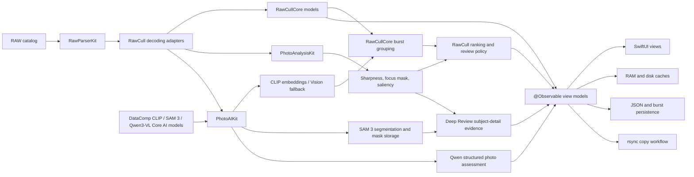
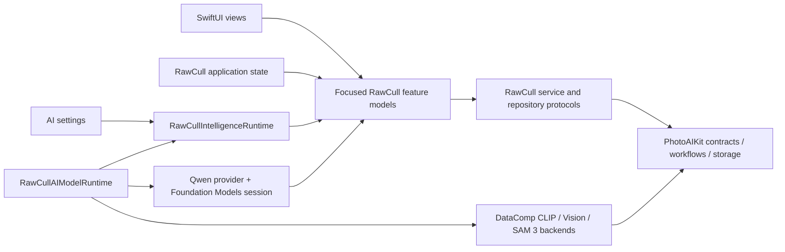

# RawCull

[](https://github.com/rsyncOSX/RawCull/blob/main/Licence.MD)

RawCull is a native macOS photo review and culling application for Sony ARW files. It combines fast embedded-preview loading with focus-point extraction, sharpness analysis, visual similarity, burst grouping, local vision-language assessment, ratings, and selective export.

The application is written in Swift 6 and SwiftUI. Focused Swift packages own image parsing, analysis, AI inference, shared culling models, JSON encoding, and rsync execution. RawCull owns application state, workflow, caching, persistence, and presentation.

| Branch | Minimum macOS | Development toolchain | Main characteristics |
|---|---:|---|---|
| `version-3.2.5` | macOS 27 | Xcode 27, Swift 6 | Local DataComp CLIP search and similarity, SAM 3 Deep Review, Qwen3-VL photo assessment, model validation, and Managed Background Assets support |

## Main capabilities

- Discover and scan supported RAW files in a selected catalog.
- Read EXIF metadata, dimensions, camera and lens information, ISO, and
  aperture.
- Extract normalized camera AF points from Sony and Nikon MakerNotes.
- Display cached thumbnails, embedded full-size JPEG previews, or developed
  RAW previews.
- Render AF-point overlays and GPU-generated focus masks.
- Score image sharpness using full-frame, salient-subject, and AF-region
  evidence.
- Apply photo-type presets and fast, balanced, or high-precision scoring.
- Group visually similar neighboring frames into bursts and rank candidates
  with sharpness, similarity, confidence, and caution details.
- Search by natural-language description when a validated CLIP model is
  available.
- Run SAM 3 Deep Review to isolate a subject and recommend a burst winner.
- Open the AI Analysis workspace for selected images or photographs rated two
  stars or higher, then choose SAM 3 + CLIP review or Qwen analysis.
- Use a local Qwen3-VL model with custom criteria to assess composition,
  exposure, subject visibility, expression, obstructions, strengths, and
  problems.
- Tag, reject, or assign star ratings to selected images.
- Persist ratings, analysis results, burst decisions, and cache signatures.
- Export embedded or developed JPEG files.
- Copy tagged or rated RAW files with streaming rsync progress.
- Monitor thumbnail-cache usage and macOS memory-pressure events.

## Local AI features

RawCull's AI-assisted culling runs locally on Apple Silicon. Photos are not
uploaded to an external inference service.

### What the AI functions do

- **Similarity and burst grouping:** CLIP image embeddings, or Vision feature
  prints as the fallback, measure visual similarity and help group neighboring
  frames for comparison.
- **Semantic search:** CLIP compares a text-query embedding with cached image
  embeddings to rank photographs by meaning.
- **Sharpness and subject evidence:** PhotoAnalysisKit combines sharpness,
  saliency, classification, focus-mask, and camera AF-point evidence to rank
  candidates and explain cautions.
- **Deep Review:** SAM 3 isolates every matching subject, evaluates detail inside the
  combined mask, checks whether the AF point falls within a subject, and recommends a
  winner with confidence and supporting reasons. **Mark Winner & Close** saves
  the winner, gives it a three-star rating, and marks the burst reviewed.
- **Qwen photo assessment:** A local Qwen3-VL vision-language model evaluates
  each selected or tagged photograph against editable criteria. It returns a
  structured subject description, composition, exposure, and subject-visibility
  scores, eye state when applicable, strengths, problems, and confidence.
- **Local caching:** Embeddings, masks, scores, and burst decisions are cached
  so compatible results can be reused in later sessions.

### DataComp CLIP, SAM 3, and Qwen3-VL

The three models are trained neural networks, but they produce different evidence:

| | DataComp CLIP | SAM 3 | Qwen3-VL |
|---|---|---|---|
| Primary task | Vision-language encoding | Vision-language segmentation | Vision-language generation |
| Inputs | Image or text | Image plus text or visual prompt | Image plus assessment criteria |
| Output | One fixed-length vector per image or text | Subject masks, boxes, presence, and confidence scores | Structured photo assessment |
| Spatial information | Compresses most of the image into one vector | Preserves detailed spatial information | Describes the whole image; does not produce a reusable mask |
| RawCull use | Search, similarity ranking, burst grouping, and coarse subject labels | Text-guided subject isolation for Deep Review | Per-photo composition, exposure, visibility, expression, strength, and problem analysis |

```text
DataComp CLIP

Image ── image encoder ──► vector ─┐
                                   ├─► similarity score
Text  ── text encoder  ──► vector ─┘

SAM 3

Image  ── image encoder ────────────┐
                                    ├─► detector + mask decoder ─► masks and boxes
Prompt ── text/visual encoder ──────┘

SAM 3 mask decoding detail

Image      ── image encoder ────────┐
                                    ├─► mask decoder ─► candidate masks
Point grid ─────────────────────────┘

Qwen3-VL

Image ──────────────────────────────┐
                                    ├─► vision-language model ─► structured assessment
Assessment criteria ────────────────┘
```

> DataComp CLIP determines **what an image is related to**; SAM 3 determines
> **where a subject is in the image**; Qwen3-VL explains **how the photograph
> meets the requested review criteria**.

CLIP image encoding runs once per photograph. Later searches reuse the cached
image vectors and only run the text-query path; comparing cached vectors is
ordinary mathematical computation, not another neural-network pass. SAM 3
normally runs for each image and prompt, but RawCull can cache and reuse the
resulting subject mask. Qwen analyzes each chosen image independently and keeps
the current batch results in memory.

Qwen assessments are advisory model output. RawCull validates their structure,
but photographers should verify the content before making culling decisions.

## Architecture



RawCull keeps application-specific policy outside the packages:

- RAW source selection and decoding size
- security-scoped folder access
- settings and user preferences
- progress and cancellation presentation
- cache locations and file identity
- ratings, tagging, burst decisions, and the culling workflow

The imported packages own reusable parsing, sharpness analysis, AI inference,
model validation, similarity artifacts, segmentation, mask storage, domain
models, serialization, and process execution.

The application-local intelligence boundary is assembled once by
`RawCullApplicationState`. Views receive focused settings, model-download,
similarity, semantic-search, Deep Review, or Qwen analysis models; the runtime
is a lifetime and configuration owner, not a forwarding facade.



`Scripts/VerifyAIImportBoundary.sh` enforces exact production import locations and
rejects the removed compatibility constructors and forwarding API. CLIP,
segmentation, and Vision backend products are confined to `RawCullAIModelRuntime`
and the focused Vision adapter. The Qwen backend imports are kept in
`QwenInferenceRuntime`; views and general application models import none of these
concrete AI products. The model-release update checklist, including Background
Assets packaging and verification, is documented in
[Integrating the v4 AI model release](updateversionmodels.md).
The boundary remains in the application target: it still uses app-owned `FileItem`
values, application callbacks, model resources, and application-support paths, so a
new Swift package would add adapters without establishing a cleaner dependency
graph.

### Swift package dependencies

Remote requirements are pinned to exact versions or revisions in the Xcode
project and recorded in `Package.resolved`. The tables below mirror every
remote pin; revision-pinned dependencies use the complete commit rather than
an abbreviated display value.

| Package (resolved identity) | Resolved pin | Responsibility | Main APIs used by RawCull |
|---|---:|---|---|
| [PhotoAIKit](https://github.com/rsyncOSX/PhotoAIKit) (`photoaikit`) | revision `c5c76590c3d79ad508d24d893cd7d8d6aa873355` | AI contracts, validated Core AI resources, DataComp CLIP, SAM 3, and Qwen inference, Vision fallback, segmentation workflows, and subject-mask storage | `CoreAICLIPProvider`, `CoreAISAM3Provider`, `CoreAIQwenProvider`, `VisionFeaturePrintBackend`, `SimilarityArtifactIndexer`, `SegmentationService`, `SubjectMaskSelector`, `SubjectMaskMemoryStore`, `SubjectMaskDiskStore` |
| [PhotoAnalysisKit](https://github.com/rsyncOSX/PhotoAnalysisKit) (`photoanalysiskit`) | `1.3.1` | Sharpness scoring, focus masks, Vision saliency and classification, calibration, batch analysis, and cache identity | `PhotoAnalyzer.analyzeBatch`, `PhotoAnalyzer.calibrate`, `PhotoAnalyzer.focusMask`, `PhotoAnalyzer.analyzeWithFocusMask`, `PhotoAnalyzer.sharpnessDescriptor`, `SharpnessPreset`, `SharpnessQuality` |
| [RawParserKit](https://github.com/rsyncOSX/RawParserKit) (`rawparserkit`) | `1.3.0` | RAW discovery, metadata parsing, embedded JPEG extraction, previews, and manufacturer MakerNote parsing | `RawFormatRegistry`, `RawImageLoader.metadata`, `thumbnailCGImage`, `thumbnail`, `previewImage`, `SonyMakerNoteParser`, `NikonMakerNoteParser`, `SupportedFileType` |
| [RawCullCore](https://github.com/rsyncOSX/RawCullCore) (`rawcullcore`) | `1.1.2` | Shared file, catalog, EXIF, burst-grouping, ranking, and review-state value types | `RawCullFileItem`, `RawCullSourceCatalog`, `ExifMetadata`, `BurstGroupingConfig`, `BurstGroupingEngine.group`, `BurstAnalysisResult`, `BurstCandidateScore`, `BurstReviewState` |
| [RsyncArguments](https://github.com/rsyncOSX/RsyncArguments) (`rsyncarguments`) | `1.0.0` | Type-safe construction of rsync and synchronization arguments | `Parameters`, `BasicRsyncParameters`, `OptionalRsyncParameters`, `SSHParameters`, `PathConfiguration`, `RsyncParametersSynchronize.argumentsForSynchronize`, `computedArguments` |
| [RsyncProcessStreaming](https://github.com/rsyncOSX/RsyncProcessStreaming) (`rsyncprocessstreaming`) | `1.0.0` | Starts and cancels rsync processes and streams file and progress output | `ProcessHandlers`, `RsyncProcess`, `executeProcess`, `cancel` |
| [ParseRsyncOutput](https://github.com/rsyncOSX/ParseRsyncOutput) (`parsersyncoutput`) | `1.0.0` | Parses rsync summaries into counts and formatted transfer statistics | `ParseRsyncOutput`, `getstats`, `numbersonly`, and the formatted file and size properties |
| [DecodeEncodeGeneric](https://github.com/rsyncOSX/DecodeEncodeGeneric) (`decodeencodegeneric`) | `1.0.0` | Generic Codable helpers for persistent JSON data | `DecodeGeneric.decodeArray`, `EncodeGeneric.encode` |

Additional resolved dependencies are recorded here as release inputs. RawCull
imports `CoreAILanguageModels` through the Qwen backend's package graph; the
remaining entries provide transitive runtime or model-tooling support:

| Resolved identity | Resolved pin | Role in the package graph |
|---|---:|---|
| `coreai-models` | revision `7359dbcf6c3babb4fbfadfd015ffcc1cb6d87420` | Core AI language-model interfaces used by Qwen and conversion support reached through PhotoAIKit |
| `eventsource` | `1.5.1` | Server-sent-event transport support used transitively by model tooling |
| `swift-asn1` | `1.7.2` | ASN.1 support reached through the cryptography stack |
| `swift-collections` | `1.6.0` | Collection data structures used by transitive packages |
| `swift-crypto` | `4.5.2` | Cryptographic primitives used by transitive packages |
| `swift-huggingface` | `0.10.1` | Hugging Face model download and metadata support used by model tooling |
| `swift-jinja` | `2.5.1` | Prompt-template rendering used by model tooling |
| `swift-transformers` | `1.3.4` | Tokenizer and transformer model support used by the AI package graph |
| `xgrammar` | `0.2.2` | Grammar-constrained model tooling used transitively by model tooling |
| `yyjson` | `0.12.0` | C JSON engine used by transitive model tooling |

## Repository structure

```text
RawCull/
├── Actors/                 Background scanning, thumbnail caching, and extraction
├── Intelligence/           RawCull intelligence boundary
│   ├── Composition/        Concrete provider assembly and stable runtime ownership
│   ├── Contracts/          RawCull-owned capability and configuration values
│   ├── Similarity/         Similarity state, indexing, ranking, and Vision adapter
│   ├── SemanticSearch/     Semantic-search feature and service boundary
│   ├── BurstAnalysis/      Burst requests, coordinator, cache decisions, and review values
│   ├── DeepReview/         Optional Deep Review controller, operation, and mask scoring
│   ├── Qwen/               Local model validation and structured photo assessment
│   ├── ModelManagement/    Model validation, downloads, licences, and settings state
│   ├── Persistence/        Intelligence artifact and burst-cache actors
│   └── Presentation/       Intelligence-owned presentation values
├── Main/                   App entry point and shared type aliases
├── Model/
│   ├── Cache/              Cache configuration and diagnostics
│   ├── Diagnostics/        RAW, ImageIO, and similarity diagnostics
│   ├── Handlers/           App and streaming callbacks
│   ├── JSON/               Codable persistence models
│   ├── ParametersRsync/    RAW copy configuration and execution
│   └── ViewModels/         MainActor application and workflow state
├── Resources/              AI model licence notices
└── Views/                  SwiftUI catalog, grid, comparison, settings, and zoom UI

RawCullModelDownloader/     Managed Background Assets extension
ModelAssets/                Model manifests, notices, and provenance catalogs
RawCullTests/               Swift Testing suites and test architecture notes
```

## Build

The commands below require Xcode 27 on an Apple Silicon Mac. Package resolution
uses the checked-in `Package.resolved` file.

Build and export a Debug archive without notarization, then reveal it in Finder:

```bash
make debug
```

This target uses the signing team configured in the project and
`exportOptionsDebug.plist`.

Before a release build, run the static AI-boundary check and the separate
release preflight:

```bash
make verify-ai-import-boundary
make release-preflight
```

The preflight requires a clean worktree, checks the existing 3.0.0 release tag
when present, and blocks release while the enabled model provenance audit is
incomplete. It is not invoked automatically by `make build`.

Maintainer release archive, Developer ID signing, notarization, stapling, and
DMG generation:

```bash
make build
```

The release workflow also requires the configured signing identity and
notarytool keychain profile, plus `create-dmg` at `../create-dmg/create-dmg`.

The release build also writes `RawCull.3.2.4.dmg.sha256`. After publishing and
downloading the DMG through its distribution path, reproduce that hash with:

```bash
make verify-downloaded-dmg DOWNLOADED_DMG=/path/to/downloaded/RawCull.3.2.4.dmg
```

The archive target uses only the package versions in the checked-in
`Package.resolved` file.

Clean generated build output:

```bash
make clean
```

The Xcode scheme builds for Apple Silicon:

```bash
xcodebuild \
  -project RawCull.xcodeproj \
  -scheme RawCull \
  -destination 'platform=OS X,arch=arm64'
```

## Tests

Tests use Apple's Swift Testing framework. Run fast package-integration and
critical smoke coverage with:

```bash
make test-smoke
```

Run the full suite with Thread Sanitizer:

```bash
make test-full
```

Run performance and extreme-concurrency coverage:

```bash
make test-performance
```

The suites cover package and AI integration, model download validation,
semantic search, Deep Review, Qwen bundle validation and structured-response
decoding, AI Analysis selection, sharpness and focus metrics, structured
cancellation, latest-run-wins behavior, memory-cache counters,
security-scoped access, disk caches, burst persistence, RAW parsing adapters,
and copy startup and cleanup.
