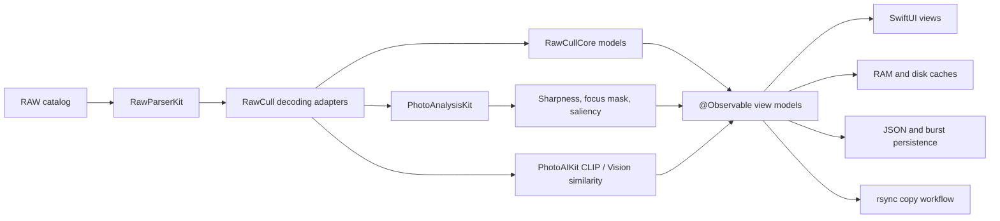

# RawCull

[](https://github.com/rsyncOSX/RawCull/blob/main/Licence.MD)

RawCull is a native macOS photo review and culling application for Sony ARW RAW files. It is built for Apple Silicon and combines fast embedded-preview loading with focus-point extraction, sharpness analysis, visual similarity, burst grouping, ratings, and selective export.

The application is written in Swift 6 with SwiftUI. Image parsing, analysis, shared culling models, JSON encoding, and rsync execution are separated into focused Swift packages so that RawCull primarily owns application state, workflow, caching, persistence, and presentation.

## Requirements

- macOS 27 or newer
- Apple Silicon Mac
- Xcode 27 or newer for development
- Swift 6 language mode

## AI features

RawCull's AI-assisted culling runs locally on Apple Silicon. Photos are not
uploaded to an external inference service.

### Requirements to run AI

- Vision feature-print similarity is built into macOS and works without an
  additional model download.
- CLIP similarity requires a validated PhotoAIKit-compatible CLIP Core AI model
  bundle. If it is missing or invalid, RawCull safely falls back to Vision
  feature prints.
- Deep Review requires a validated PhotoAIKit-compatible SAM 3 Core AI model
  bundle. The feature remains unavailable when the model is missing or invalid.
- CLIP and SAM 3 model bundles must contain `metadata.json`, the selected
  `.aimodel` or `.aimodelc` asset, and any resources declared by the model
  manifest.
- Models are not bundled with RawCull, and the in-app SAM 3 download is not yet
  implemented. Install the resources manually, then open **Settings > AI** and
  select **Check Again** to validate them. The standard non-sandboxed locations
  are:

  ```text
  ~/Library/Application Support/RawCull/Models/CLIP/
  ~/Library/Application Support/RawCull/Models/SAM3/
  ```

  Sandboxed builds resolve Application Support inside the app container;
  **Settings > AI** displays the exact expected path.
- The first use of a portable Core AI model can take longer while macOS
  specializes the model for the current Mac.

See [AI model distribution and installation](doc/models.md) for model format,
validation, and installation details.

### What the AI functions do

- **Similarity and burst grouping:** CLIP image embeddings, or Vision feature
  prints as the fallback, measure visual similarity and help group neighboring
  frames into bursts for comparison.
- **Sharpness and subject evidence:** PhotoAnalysisKit combines sharpness,
  saliency, classification, focus-mask, and camera AF-point evidence to rank
  burst candidates and explain cautions.
- **Deep Review:** SAM 3 isolates the subject, evaluates detail inside the mask,
  checks whether the AF point falls within the subject, and recommends a winner
  with confidence and supporting reasons. Choosing **Mark Winner & Close** saves
  the winner, gives it a three-star rating, and marks the burst reviewed.
- **Local caching:** Embeddings, masks, scores, and burst decisions are cached
  locally so compatible results can be reused in later sessions.

To use CLIP, enable **Use CLIP for similarity** under **Settings > AI** after the
model is validated. To use SAM 3, analyze a catalog into burst groups, select
**Deep Review** on a burst, choose the review target, and run the review.

## Installation

Install with Homebrew:

```bash
brew tap rsyncOSX/cask
brew install --cask rawcull
```

RawCull is also available from the [Apple App Store](https://apps.apple.com/no/app/rawcull/id6759362764?mt=12) and [GitHub Releases](https://github.com/rsyncOSX/RawCull/releases).

## Documentation

- [User documentation](https://rawcull.netlify.app)
- [Release notes](https://rawcull.netlify.app/blog/)
- [GitHub releases](https://github.com/rsyncOSX/RawCull/releases)

## Main capabilities

- Discover and scan supported RAW files in a selected catalog.
- Read EXIF metadata, dimensions, camera/lens information, ISO, and aperture.
- Extract normalized camera AF points from Sony MakerNotes.
- Display cached thumbnails, embedded full-size JPEG previews, or developed RAW
  previews.
- Render AF-point overlays and GPU-generated focus masks.
- Score image sharpness using full-frame, salient-subject, and AF-region
  evidence.
- Apply photo-type presets and fast, balanced, or high-precision scoring.
- Generate validated CLIP image embeddings for similarity ranking and burst
  grouping, with targeted retry/provider recovery and safe per-image exclusion.
- Compare burst candidates with sharpness, similarity, and caution details.
- Tag, reject, or assign star ratings to selected images.
- Persist ratings, sharpness results, saliency labels, burst decisions, and
  cache signatures.
- Export embedded or developed JPEG files.
- Copy tagged or rated RAW files with streaming rsync progress.
- Monitor thumbnail-cache usage and macOS memory-pressure events.

## Architecture overview



RawCull keeps application-specific policy outside the packages:

- RAW source selection and decoding size
- security-scoped folder access
- settings and user preferences
- progress and cancellation presentation
- cache locations and file identity
- ratings, tagging, burst decisions, and culling workflow

The imported packages own reusable parsing, analysis, domain, serialization, and process-execution concerns.

## Imported Swift packages

All package requirements are exact versions in the Xcode project and are recorded in `Package.resolved`.

| Package | Version | Responsibility | Main APIs used by RawCull |
|---|---:|---|---|
| [PhotoAnalysisKit](https://github.com/rsyncOSX/PhotoAnalysisKit) | 1.2.0 | Sharpness scoring, focus masks, Vision saliency/classification, calibration, batch analysis, cache identity, and Vision feature prints | `PhotoAnalyzer.analyzeBatch`, `PhotoAnalyzer.calibrate`, `PhotoAnalyzer.focusMask`, `PhotoAnalyzer.analyzeWithFocusMask`, `PhotoAnalyzer.sharpnessDescriptor`, `SharpnessPreset`, `SharpnessQuality`, `VisionFeaturePrintBackend.featurePrint`, `VisionFeaturePrintBackend.distance` |
| [RawParserKit](https://github.com/rsyncOSX/RawParserKit) | 1.2.6 | RAW discovery, metadata parsing, embedded JPEG extraction, previews, and manufacturer MakerNote parsing | `RawFormatRegistry`, `RawImageLoader.metadata`, `thumbnailCGImage`, `thumbnail`, `previewImage`, `SonyMakerNoteParser`, `NikonMakerNoteParser`, `SupportedFileType` |
| [RawCullCore](https://github.com/rsyncOSX/RawCullCore) | 1.1.0 | Shared file, catalog, EXIF, burst-grouping, ranking, and review-state value types | `RawCullFileItem`, `RawCullSourceCatalog`, `ExifMetadata`, `BurstGroupingConfig`, `BurstGroupingEngine.group`, `BurstAnalysisResult`, `BurstCandidateScore`, `BurstReviewState` |
| [RsyncArguments](https://github.com/rsyncOSX/RsyncArguments) | 1.0.0 | Type-safe construction of rsync parameters and synchronization arguments | `Parameters`, `BasicRsyncParameters`, `OptionalRsyncParameters`, `SSHParameters`, `PathConfiguration`, `RsyncParametersSynchronize.argumentsForSynchronize`, `computedArguments` |
| [RsyncProcessStreaming](https://github.com/rsyncOSX/RsyncProcessStreaming) | 1.0.0 | Starts and cancels rsync processes and streams file/progress output | `ProcessHandlers`, `RsyncProcess`, `executeProcess`, `cancel` |
| [ParseRsyncOutput](https://github.com/rsyncOSX/ParseRsyncOutput) | 1.0.0 | Parses rsync summary output into counts and formatted transfer statistics | `ParseRsyncOutput`, `getstats`, `numbersonly`, and the formatted file/size properties |
| [DecodeEncodeGeneric](https://github.com/rsyncOSX/DecodeEncodeGeneric) | 1.0.0 | Generic Codable helpers for persistent JSON data | `DecodeGeneric.decodeArray`, `EncodeGeneric.encode` |

## Main package integrations

### PhotoAnalysisKit

PhotoAnalysisKit owns the complete reusable focus and sharpness pipeline:

1. RawCull selects an embedded preview or a Core Image demosaiced RAW image.
2. `RawCullPhotoAnalysisAdapter` supplies asynchronous `PhotoAnalysisInput` providers.
3. `PhotoAnalyzer.analyzeBatch` performs bounded concurrent analysis and reports completion progress.
4. `SharpnessScoringModel` publishes scores, saliency summaries, focus breakdowns, and estimated time to the UI.
5. `PhotoAnalyzer.calibrate` derives a visual focus threshold from a catalog or burst.
6. `PhotoAnalyzer.focusMask` and `analyzeWithFocusMask` generate the focus overlay and its supporting evidence.

Per-image ISO, aperture, and normalized AF position are passed through `PhotoAnalysisInput`. Photo-type and quality choices map to package-owned `SharpnessPreset` and `SharpnessQuality` values.

Persistent sharpness results use `PhotoAnalyzer.sharpnessDescriptor(for:)`. RawCull layers the scoring source, decoded image size, source-file size, and modification date around that descriptor. This invalidates stale scores when either the package algorithm or the input file changes.

PhotoAIKit provides RawCull's similarity backends:

- `CoreAICLIPProvider` creates normalized CLIP image embeddings and cosine distances.
- `VisionFeaturePrintBackend` creates and compares Codable Vision feature prints.
- A persisted setting selects CLIP when its validated model is available.
  Non-finite output is retried once, then retried with a replacement provider;
  unresolved images are excluded from automatic burst analysis.
- Adjacent distances are passed to `BurstGroupingEngine.group` from RawCullCore.

PhotoAnalysisKit deliberately does not know about `FileItem`, RAW formats, security-scoped URLs, application settings, cache directories, or ratings.

### RawParserKit

RawParserKit is the boundary between camera RAW files and RawCull's application models.

`RawParserKitImageLoader` adapts package results to RawCull:

- `RawImageLoader.metadata(for:)` becomes RawCullCore `ExifMetadata`.
- `RawImageLoader.thumbnailCGImage` feeds thumbnail caching, sharpness scoring, and feature-print generation.
- `RawImageLoader.thumbnail` supplies AppKit thumbnail images.
- `RawImageLoader.previewImage` supplies embedded full-size previews.
- MakerNote focus coordinates are converted to normalized `CGPoint` values.

`RawFormatRegistry` is used for supported-file discovery. The diagnostic tools also call the Sony and Nikon MakerNote parsers directly to report embedded JPEG locations and focus metadata.

### RawCullCore

RawCullCore contains application-neutral domain types shared across RawCull workflows. RawCull uses aliases for its central models:

```swift
typealias FileItem = RawCullFileItem
typealias ARWSourceCatalog = RawCullSourceCatalog
typealias ExifMetadata = RawCullCore.ExifMetadata
```

The package also owns the burst-grouping contracts and algorithm. RawCull provides ordered files and adjacent visual distances, then stores and presents the resulting groups, candidate scores, confidence, cautions, and review state.

### Rsync packages

The RAW copy workflow is divided into three package responsibilities:

1. `RsyncArguments` builds the base rsync argument list.
2. RawCull adds a NUL-separated `--files-from` list containing the selected tagged or rated filenames and appends security-scoped source/destination paths.
3. `RsyncProcessStreaming` executes `/usr/bin/rsync`, streams progress, and supports cancellation.
4. `ParseRsyncOutput` converts the final output into file counts, transferred sizes, created/deleted counts, and display-ready statistics.

### DecodeEncodeGeneric

RawCull persists its saved catalog records as Codable JSON. `DecodeGeneric` loads the stored array, while `EncodeGeneric` creates the encoded data written atomically to Application Support.

## Apple framework imports

| Framework | Main use |
|---|---|
| `SwiftUI` | Application scenes, navigation, grids, comparison views, settings, overlays, and controls |
| `Observation` | `@Observable` view models and application state |
| `AppKit` | `NSImage`, macOS windows, panels, pasteboard, and image bridging |
| `Foundation` | URLs, file management, Codable, tasks, dates, collections, and persistence |
| `CoreGraphics` | `CGImage`, normalized AF coordinates, image sizes, and drawing |
| `CoreImage` | Optional `CIRAWFilter` demosaicing for developed-RAW previews and high-precision scoring |
| `ImageIO` | JPEG properties, orientation, image-source diagnostics, and cache encoding/decoding |
| `CryptoKit` | Stable MD5-derived disk-cache keys |
| `Dispatch` | macOS memory-pressure monitoring |
| `OSLog` and `os` | Structured logging and lock-backed cache diagnostics |
| `UniformTypeIdentifiers` | RAW/JPEG file selection and export types |

Vision and Metal are encapsulated by PhotoAnalysisKit rather than implemented
directly in RawCull.

## Application flow

### Catalog loading

1. The user selects a security-scoped catalog.
2. `ScanFiles` identifies supported files through RawParserKit.
3. Metadata and AF information are read concurrently.
4. RawCullCore `FileItem` values are created and published to the main actor.
5. Ratings and persisted sharpness results are restored when their file and
   analysis signatures still match.

### Thumbnail and preview loading

RawCull uses a two-tier thumbnail cache:

1. `SharedMemoryCache` provides the RAM layer through `NSCache`.
2. `DiskCacheManager` stores JPEG thumbnails below
   `~/Library/Caches/no.blogspot.RawCull/Thumbnails/`.
3. A cache miss is decoded through RawParserKit.

Full-size embedded and developed previews use a separate disk cache. Memory pressure is monitored with `DispatchSourceMemoryPressure`, allowing RawCull to reduce cache pressure while keeping diagnostics available in the Memory Console.

### Sharpness and focus

1. RawCull creates package batch requests for the selected files.
2. PhotoAnalysisKit invokes RawCull's decoding providers with bounded concurrency and analyzes the resulting inputs.
3. The package runs saliency, classification, Gaussian blur, Metal Laplacian analysis, regional scoring, and failure classification.
4. RawCull stores the scalar score, subject summary, and detailed breakdown.
5. Focus-mask views request a package-rendered mask using existing evidence when possible.

### Similarity and burst review

1. RawParserKit supplies 512-pixel thumbnails.
2. PhotoAIKit creates CLIP image embeddings. RawCull validates each artifact,
   performs targeted recovery for non-finite output, and excludes unresolved
   images; Vision remains the catalog backend when CLIP is unavailable.
3. RawCull calculates adjacent distances and passes them to RawCullCore.
4. RawCullCore groups the ordered images into bursts.
5. RawCull ranks candidates using sharpness, similarity, and review rules.
6. Burst artifacts and decisions are cached for later sessions.

### Ratings, persistence, and copying

Ratings, tags, saliency labels, sharpness signatures, and manual burst winners are stored in:

```text
~/Library/Application Support/RawCull/savedfiles.json
```

Settings are stored separately in:

```text
~/Library/Application Support/RawCull/settings.json
```

When copying selected RAW files, RawCull creates a temporary `--files-from` list, starts rsync with streaming handlers, updates progress, parses the final statistics, and releases both security-scoped folders during cleanup.

## Concurrency model

- View models are `@Observable`, `final`, and `@MainActor`.
- Background concerns use actor-per-responsibility isolation.
- Package boundary values and providers conform to `Sendable`.
- Dynamic parallel work uses structured task groups with bounded concurrency.
- Long-running scans, analysis, extraction, grouping, and copy operations
  support cooperative cancellation.
- Results are committed to observable state only after successful completion.
- Superseded similarity and grouping generations cannot publish stale results.

Important actors include:

| Actor | Responsibility |
|---|---|
| `SharedMemoryCache` | RAM thumbnails, grid-cache admission, memory-pressure handling, and diagnostics |
| `DiskCacheManager` | Thumbnail JPEG persistence |
| `FullSizeJPGDiskCache` | Embedded and developed full-size preview persistence |
| `ScanFiles` | Catalog scanning, metadata extraction, and AF-point collection |
| `ScanAndCreateThumbnails` | Bounded thumbnail preloading |
| `ExtractAndSaveJPGs` | Batch JPEG extraction |
| `BurstAnalysisCache` | Burst groups, embeddings, sharpness results, signatures, and review-state snapshots |
| `WriteSavedFilesJSON` | Atomic persistence of culling records |

## Repository structure

```text
RawCull/
├── Actors/                 Background scanning, caching, extraction, and persistence
├── Main/                   App entry point and shared type aliases
├── Model/
│   ├── Cache/              Cache configuration and diagnostics
│   ├── Diagnostics/        RAW and ImageIO diagnostics
│   ├── Handlers/           App and streaming callbacks
│   ├── JSON/               Codable persistence models
│   ├── ParametersRsync/    RAW copy configuration and execution
│   └── ViewModels/         MainActor application and workflow state
├── Views/                  SwiftUI catalog, grid, comparison, settings, and zoom UI
└── Assets.xcassets

RawCullTests/
├── TEST_ARCHITECTURE.md
└── Swift Testing suites
```

## Build

Debug build without notarization:

```bash
make debug
```

Release archive, signing, notarization, stapling, and DMG generation:

```bash
make build
```

Clean generated build output:

```bash
make clean
```

The Xcode scheme builds for Apple Silicon:

```bash
xcodebuild \
  -project RawCull.xcodeproj \
  -scheme RawCull \
  -destination 'platform=OS X,arch=arm64'
```

## Tests

Tests use Apple's Swift Testing framework. Fast package-integration and critical smoke coverage:

```bash
make test-smoke
```

Full suite with Thread Sanitizer:

```bash
make test-full
```

Performance and extreme-concurrency coverage:

```bash
make test-performance
```

The test suites cover package integration, sharpness and focus metrics, structured cancellation, latest-run-wins behavior, memory-cache counters, security-scoped access, disk caches, burst persistence, RAW parsing adapters, and copy startup/cleanup.
