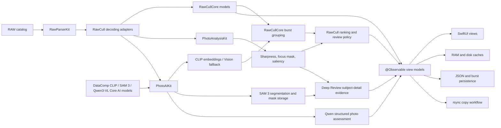
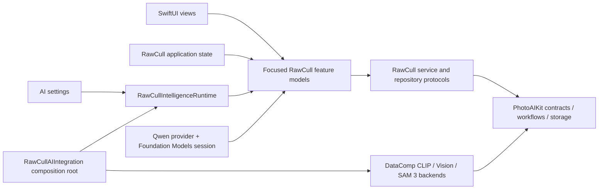

# RawCull

[](https://github.com/rsyncOSX/RawCull/blob/main/Licence.MD)

> [!IMPORTANT]
> **This is the AI-based version of RawCull.** The `version-3.2.4` branch requires macOS 27, an Apple Silicon Mac, and Xcode 27 to build. For macOS 26, use `version-3.0.0`.

The latest released version is available from [the Mac App Store](https://apps.apple.com/no/app/rawcull/id6759362764?mt=12). RawCull version 3.2.4 is available via Apple’s TestFlight; please email thomeven@gmail.com if you would like to try it through that service.

RawCull is a native macOS photo review and culling application for Sony ARW and Nikon NEF RAW files. It combines fast embedded-preview loading with focus-point extraction, sharpness analysis, visual similarity, burst grouping, local vision-language assessment, ratings, and selective export.

The application is written in Swift 6 and SwiftUI. Focused Swift packages own image parsing, analysis, AI inference, shared culling models, JSON encoding, and rsync execution. RawCull owns application state, workflow, caching, persistence, and presentation.

## Supported versions and requirements

| Branch | Minimum macOS | Development toolchain | Main characteristics |
|---|---:|---|---|
| `version-3.2.4` | macOS 27 | Xcode 27, Swift 6 | Local DataComp CLIP search and similarity, SAM 3 Deep Review, Qwen3-VL photo assessment, model validation, and Managed Background Assets support |
| `version-3.0.0` | macOS 26.2 | Xcode 26, Swift 6 | macOS 26 release line using built-in Vision feature prints for visual similarity and burst grouping |

Both versions require an Apple Silicon Mac. The main difference between the macOS 26 and macOS 27 editions is the AI layer, not the basic photo-culling workflow: the macOS 26 edition uses Apple's built-in Vision feature prints, whereas the macOS 27 edition adds local DataComp CLIP text-to-image search and optional similarity analysis, SAM 3 subject segmentation for Deep Review, and Qwen3-VL structured photo assessment. Similarity falls back to Vision when the CLIP model is unavailable.


## Main capabilities

- Discover and scan supported RAW files in a selected catalog.
- Read EXIF metadata, dimensions, camera and lens information, ISO, and
  aperture.
- Extract normalized camera AF points from Sony and Nikon MakerNotes.
- Display cached thumbnails, embedded full-size JPEG previews, or developed
  RAW previews.
- Render AF-point overlays and GPU-generated focus masks.
- Score image sharpness using full-frame, salient-subject, and AF-region
  evidence.
- Apply photo-type presets and fast, balanced, or high-precision scoring.
- Group visually similar neighboring frames into bursts and rank candidates
  with sharpness, similarity, confidence, and caution details.
- Search by natural-language description when a validated CLIP model is
  available.
- Run SAM 3 Deep Review to isolate a subject and recommend a burst winner.
- Open the AI Analysis workspace for selected images or photographs rated two
  stars or higher, then choose SAM 3 + CLIP review or Qwen analysis.
- Use a local Qwen3-VL model with custom criteria to assess composition,
  exposure, subject visibility, expression, obstructions, strengths, and
  problems.
- Tag, reject, or assign star ratings to selected images.
- Persist ratings, analysis results, burst decisions, and cache signatures.
- Export embedded or developed JPEG files.
- Copy tagged or rated RAW files with streaming rsync progress.
- Monitor thumbnail-cache usage and macOS memory-pressure events.

## Local AI features

RawCull's AI-assisted culling runs locally on Apple Silicon. Photos are not
uploaded to an external inference service.

### What the AI functions do

- **Similarity and burst grouping:** CLIP image embeddings, or Vision feature
  prints as the fallback, measure visual similarity and help group neighboring
  frames for comparison.
- **Semantic search:** CLIP compares a text-query embedding with cached image
  embeddings to rank photographs by meaning.
- **Sharpness and subject evidence:** PhotoAnalysisKit combines sharpness,
  saliency, classification, focus-mask, and camera AF-point evidence to rank
  candidates and explain cautions.
- **Deep Review:** SAM 3 isolates every matching subject, evaluates detail inside the
  combined mask, checks whether the AF point falls within a subject, and recommends a
  winner with confidence and supporting reasons. **Mark Winner & Close** saves
  the winner, gives it a three-star rating, and marks the burst reviewed.
- **Qwen photo assessment:** A local Qwen3-VL vision-language model evaluates
  each selected or tagged photograph against editable criteria. It returns a
  structured subject description, composition, exposure, and subject-visibility
  scores, eye state when applicable, strengths, problems, and confidence.
- **Local caching:** Embeddings, masks, scores, and burst decisions are cached
  so compatible results can be reused in later sessions.

### DataComp CLIP, SAM 3, and Qwen3-VL

The three models are trained neural networks, but they produce different evidence:

| | DataComp CLIP | SAM 3 | Qwen3-VL |
|---|---|---|---|
| Primary task | Vision-language encoding | Vision-language segmentation | Vision-language generation |
| Inputs | Image or text | Image plus text or visual prompt | Image plus assessment criteria |
| Output | One fixed-length vector per image or text | Subject masks, boxes, presence, and confidence scores | Structured photo assessment |
| Spatial information | Compresses most of the image into one vector | Preserves detailed spatial information | Describes the whole image; does not produce a reusable mask |
| RawCull use | Search, similarity ranking, burst grouping, and coarse subject labels | Text-guided subject isolation for Deep Review | Per-photo composition, exposure, visibility, expression, strength, and problem analysis |

```text
DataComp CLIP

Image ── image encoder ──► vector ─┐
                                   ├─► similarity score
Text  ── text encoder  ──► vector ─┘

SAM 3

Image  ── image encoder ────────────┐
                                    ├─► detector + mask decoder ─► masks and boxes
Prompt ── text/visual encoder ──────┘

SAM 3 mask decoding detail

Image      ── image encoder ────────┐
                                    ├─► mask decoder ─► candidate masks
Point grid ─────────────────────────┘

Qwen3-VL

Image ──────────────────────────────┐
                                    ├─► vision-language model ─► structured assessment
Assessment criteria ────────────────┘
```

> DataComp CLIP determines **what an image is related to**; SAM 3 determines
> **where a subject is in the image**; Qwen3-VL explains **how the photograph
> meets the requested review criteria**.

CLIP image encoding runs once per photograph. Later searches reuse the cached
image vectors and only run the text-query path; comparing cached vectors is
ordinary mathematical computation, not another neural-network pass. SAM 3
normally runs for each image and prompt, but RawCull can cache and reuse the
resulting subject mask. Qwen analyzes each chosen image independently and keeps
the current batch results in memory.

Qwen assessments are advisory model output. RawCull validates their structure,
but photographers should verify the content before making culling decisions.

### AI model requirements and setup

- Vision feature-print similarity is built into macOS and requires no model
  download.
- CLIP similarity requires a validated, PhotoAIKit-compatible DataComp CLIP
  Core AI model bundle. RawCull falls back to Vision feature prints when it is
  missing or invalid. Semantic search requires a valid CLIP model.
- Deep Review requires a validated, PhotoAIKit-compatible SAM 3 Core AI model
  bundle. SAM 3 supports text-guided targets.
- Qwen analysis requires a compatible local Qwen vision-language Core AI
  bundle, such as Qwen3-VL-2B-Instruct. Text-only Qwen bundles are rejected.
- Each bundle must contain `metadata.json`, the selected `.aimodel` or
  `.aimodelc` asset, and all resources declared by its manifest.
- Models are not bundled with RawCull. **Settings > AI > Download AI Models**
  provides the Managed Background Assets flow for licence review, download
  progress, cancellation, and removal for the published DataComp CLIP and SAM 3
  packs.
- Qwen is configured separately. In **Settings > AI**, choose **Select Qwen
  Model**, select the local vision-language model folder, and let RawCull
  validate it. RawCull stores a security-scoped bookmark so it can reopen the
  selected folder.
- The first use of a portable Core AI model can take longer while macOS
  specializes it for the current Mac.

Manual installation also remains available for CLIP and SAM 3. Install the
resources, open **Settings > AI**, and select **Check Again** to validate them.
Standard non-sandboxed locations are:

```text
~/Library/Application Support/RawCull/Models/CLIP-DataComp/
~/Library/Application Support/RawCull/Models/SAM3/
```

Sandboxed builds use:

```text
~/Library/Containers/no.blogspot.RawCull/Data/Library/Application Support/RawCull/Models/CLIP-DataComp/
~/Library/Containers/no.blogspot.RawCull/Data/Library/Application Support/RawCull/Models/SAM3/
```

**Settings > AI** displays the exact expected paths. To enable CLIP, validate
the DataComp model and enable **Use selected CLIP model for similarity**. To use
segmentation, select **SAM 3** as the Deep Review model, analyze a catalog into
burst groups, choose **Deep Review** on a burst, select the review target, and
run the review. The separate **AI Analysis** workspace accepts the current Grid
selection or images rated two stars or higher and offers **SAM 3 + CLIP** and
**Qwen** modes.

See [Model asset packs](ModelAssets/README.md) for the managed CLIP and SAM 3
release status, licence and provenance catalogs, packaging steps, and hosting
configuration. Qwen's converted-model details are recorded in its
[third-party notice](ModelAssets/Notices/Qwen/NOTICE.md) and
[provenance catalog](ModelAssets/Notices/Qwen/PROVENANCE.json).

## Architecture



RawCull keeps application-specific policy outside the packages:

- RAW source selection and decoding size
- security-scoped folder access
- settings and user preferences
- progress and cancellation presentation
- cache locations and file identity
- ratings, tagging, burst decisions, and the culling workflow

The imported packages own reusable parsing, sharpness analysis, AI inference,
model validation, similarity artifacts, segmentation, mask storage, domain
models, serialization, and process execution.

The application-local intelligence boundary is assembled once by
`RawCullApplicationState`. Views receive focused settings, model-download,
similarity, semantic-search, Deep Review, or Qwen analysis models; the runtime
is a lifetime and configuration owner, not a forwarding facade.



`Scripts/VerifyAIImportBoundary.sh` enforces exact production import locations and
rejects the removed compatibility constructors and forwarding API. CLIP,
segmentation, and Vision backend products are confined to `RawCullAIIntegration`
and the focused Vision adapter. The Qwen backend imports are kept in
`QwenModelManager`; views and general application models import none of these
concrete AI products. The model-release update checklist, including Background
Assets packaging and verification, is documented in
[Integrating the v4 AI model release](updateversionmodels.md).
The boundary remains in the application target: it still uses app-owned `FileItem`
values, application callbacks, model resources, and application-support paths, so a
new Swift package would add adapters without establishing a cleaner dependency
graph.

### Swift package dependencies

Remote requirements are pinned to exact versions or revisions in the Xcode
project and recorded in `Package.resolved`. The tables below mirror every
remote pin; revision-pinned dependencies use the complete commit rather than
an abbreviated display value.

| Package (resolved identity) | Resolved pin | Responsibility | Main APIs used by RawCull |
|---|---:|---|---|
| [PhotoAIKit](https://github.com/rsyncOSX/PhotoAIKit) (`photoaikit`) | revision `c5c76590c3d79ad508d24d893cd7d8d6aa873355` | AI contracts, validated Core AI resources, DataComp CLIP, SAM 3, and Qwen inference, Vision fallback, segmentation workflows, and subject-mask storage | `CoreAICLIPProvider`, `CoreAISAM3Provider`, `CoreAIQwenProvider`, `VisionFeaturePrintBackend`, `SimilarityArtifactIndexer`, `SegmentationService`, `SubjectMaskSelector`, `SubjectMaskMemoryStore`, `SubjectMaskDiskStore` |
| [PhotoAnalysisKit](https://github.com/rsyncOSX/PhotoAnalysisKit) (`photoanalysiskit`) | `1.3.1` | Sharpness scoring, focus masks, Vision saliency and classification, calibration, batch analysis, and cache identity | `PhotoAnalyzer.analyzeBatch`, `PhotoAnalyzer.calibrate`, `PhotoAnalyzer.focusMask`, `PhotoAnalyzer.analyzeWithFocusMask`, `PhotoAnalyzer.sharpnessDescriptor`, `SharpnessPreset`, `SharpnessQuality` |
| [RawParserKit](https://github.com/rsyncOSX/RawParserKit) (`rawparserkit`) | `1.3.0` | RAW discovery, metadata parsing, embedded JPEG extraction, previews, and manufacturer MakerNote parsing | `RawFormatRegistry`, `RawImageLoader.metadata`, `thumbnailCGImage`, `thumbnail`, `previewImage`, `SonyMakerNoteParser`, `NikonMakerNoteParser`, `SupportedFileType` |
| [RawCullCore](https://github.com/rsyncOSX/RawCullCore) (`rawcullcore`) | `1.1.2` | Shared file, catalog, EXIF, burst-grouping, ranking, and review-state value types | `RawCullFileItem`, `RawCullSourceCatalog`, `ExifMetadata`, `BurstGroupingConfig`, `BurstGroupingEngine.group`, `BurstAnalysisResult`, `BurstCandidateScore`, `BurstReviewState` |
| [RsyncArguments](https://github.com/rsyncOSX/RsyncArguments) (`rsyncarguments`) | `1.0.0` | Type-safe construction of rsync and synchronization arguments | `Parameters`, `BasicRsyncParameters`, `OptionalRsyncParameters`, `SSHParameters`, `PathConfiguration`, `RsyncParametersSynchronize.argumentsForSynchronize`, `computedArguments` |
| [RsyncProcessStreaming](https://github.com/rsyncOSX/RsyncProcessStreaming) (`rsyncprocessstreaming`) | `1.0.0` | Starts and cancels rsync processes and streams file and progress output | `ProcessHandlers`, `RsyncProcess`, `executeProcess`, `cancel` |
| [ParseRsyncOutput](https://github.com/rsyncOSX/ParseRsyncOutput) (`parsersyncoutput`) | `1.0.0` | Parses rsync summaries into counts and formatted transfer statistics | `ParseRsyncOutput`, `getstats`, `numbersonly`, and the formatted file and size properties |
| [DecodeEncodeGeneric](https://github.com/rsyncOSX/DecodeEncodeGeneric) (`decodeencodegeneric`) | `1.0.0` | Generic Codable helpers for persistent JSON data | `DecodeGeneric.decodeArray`, `EncodeGeneric.encode` |

Additional resolved dependencies are recorded here as release inputs. RawCull
imports `CoreAILanguageModels` through the Qwen backend's package graph; the
remaining entries provide transitive runtime or model-tooling support:

| Resolved identity | Resolved pin | Role in the package graph |
|---|---:|---|
| `coreai-models` | revision `7359dbcf6c3babb4fbfadfd015ffcc1cb6d87420` | Core AI language-model interfaces used by Qwen and conversion support reached through PhotoAIKit |
| `eventsource` | `1.5.1` | Server-sent-event transport support used transitively by model tooling |
| `swift-asn1` | `1.7.2` | ASN.1 support reached through the cryptography stack |
| `swift-collections` | `1.6.0` | Collection data structures used by transitive packages |
| `swift-crypto` | `4.5.2` | Cryptographic primitives used by transitive packages |
| `swift-huggingface` | `0.10.1` | Hugging Face model download and metadata support used by model tooling |
| `swift-jinja` | `2.5.1` | Prompt-template rendering used by model tooling |
| `swift-transformers` | `1.3.4` | Tokenizer and transformer model support used by the AI package graph |
| `xgrammar` | `0.2.2` | Grammar-constrained model tooling used transitively by model tooling |
| `yyjson` | `0.12.0` | C JSON engine used by transitive model tooling |

## Workflows and package boundaries

### Catalog loading and RAW parsing

1. The user selects a security-scoped catalog.
2. `ScanFiles` discovers supported files through RawParserKit.
3. Metadata and AF information are read concurrently.
4. RawCullCore `FileItem` values are created and published to the main actor.
5. Ratings and compatible persisted analysis results are restored.

`RawParserKitImageLoader` adapts package results to RawCull:

- `RawImageLoader.metadata(for:)` becomes RawCullCore `ExifMetadata`.
- `RawImageLoader.thumbnailCGImage` feeds thumbnail caching, sharpness scoring,
  and feature generation.
- `RawImageLoader.thumbnail` supplies AppKit thumbnail images.
- `RawImageLoader.previewImage` supplies embedded full-size previews.
- MakerNote focus coordinates become normalized `CGPoint` values.

`RawFormatRegistry` handles supported-file discovery. Diagnostic tools also
call the Sony and Nikon MakerNote parsers directly to report embedded JPEG
locations and focus metadata.

### Thumbnail and preview loading

RawCull uses a two-tier thumbnail cache:

1. `SharedMemoryCache` provides the RAM layer through `NSCache`.
2. `DiskCacheManager` stores JPEG thumbnails below
   `~/Library/Caches/no.blogspot.RawCull/Thumbnails/`.
3. RawParserKit decodes a thumbnail when both caches miss.

Full-size embedded and developed previews use a separate disk cache. A
`DispatchSourceMemoryPressure` monitor lets RawCull reduce cache pressure while
keeping diagnostics available in the Memory Console.

### Sharpness and focus analysis

PhotoAnalysisKit owns the reusable focus and sharpness pipeline:

1. RawCull selects an embedded preview or a Core Image demosaiced RAW image.
2. `RawCullPhotoAnalysisAdapter` supplies asynchronous `PhotoAnalysisInput`
   providers.
3. `PhotoAnalyzer.analyzeBatch` performs bounded concurrent analysis and
   reports progress.
4. The package performs saliency, classification, Gaussian blur, Metal
   Laplacian analysis, regional scoring, and failure classification.
5. `SharpnessScoringModel` publishes scores, subject summaries, focus
   breakdowns, and estimated time to the UI.
6. `PhotoAnalyzer.calibrate` derives a visual focus threshold from a catalog
   or burst.
7. `PhotoAnalyzer.focusMask` and `analyzeWithFocusMask` render the focus overlay
   and its supporting evidence.

Each `PhotoAnalysisInput` carries ISO, aperture, and normalized AF position.
Photo-type and quality choices map to `SharpnessPreset` and
`SharpnessQuality`. Persistent results use
`PhotoAnalyzer.sharpnessDescriptor(for:)`, combined with RawCull's scoring
source, decoded size, source-file size, and modification date so stale results
are invalidated when the algorithm or input changes.

PhotoAnalysisKit does not know about `FileItem`, RAW formats, security-scoped
URLs, application settings, cache directories, or ratings.

### Similarity, semantic search, Deep Review, and Qwen

RawCull imports focused PhotoAIKit products for contracts, workflows, storage,
CLIP, Vision feature prints, segmentation, and Qwen vision-language inference.

- `CoreAICLIPProvider` creates normalized CLIP image embeddings and cosine
  distances.
- `VisionFeaturePrintBackend` creates and compares Codable Vision feature
  prints.
- `CoreAISAM3Provider` performs in-process subject segmentation with a
  validated SAM 3 Core AI model.
- `CoreAIQwenProvider` validates and loads a local Qwen vision-language model;
  a Foundation Models session generates each structured assessment.
- `SegmentationService` and `SubjectMaskSelector` acquire and select masks;
  `PhotoAIStorage` supplies their memory and disk stores.
- Persisted settings select the DataComp CLIP bundle and enable it when
  available. Non-finite output is retried once, then retried with a
  replacement provider; unresolved images are excluded from automatic burst
  analysis.

For burst analysis, RawParserKit supplies 512-pixel thumbnails, PhotoAIKit
creates and validates CLIP artifacts or uses Vision, and RawCull passes adjacent
distances to `BurstGroupingEngine.group`. RawCullCore groups the ordered images;
RawCull ranks the candidates and caches the artifacts and decisions. Deep
Review adds subject masks from the selected segmentation backend and
subject-detail evidence to that workflow.

`RawCullAIIntegration` validates the model bundles, selects CLIP or the Vision
fallback, constructs SAM 3 mask services, and injects narrow
services into the application models. RawCull retains ownership of RAW decoding,
model locations, settings, subject-detail scoring, recommendation policy,
ratings, and review state.

`QwenModelManager` is the separate boundary for Qwen. It validates that the
chosen bundle has vision capability, lazily loads the model, and creates a new
session for each photograph. `RawCullQwenAnalysisFeature` decodes a 2048-pixel
thumbnail, runs selected or two-star-and-higher images sequentially, supports
cancellation, and publishes structured per-file results and failures to the AI
Analysis workspace. Qwen output is validated before presentation: all three
scores must be integers from 1 through 5 and confidence must be between 0 and
1.

### Domain models, persistence, and copying

RawCullCore contains application-neutral domain types. RawCull aliases its
central models:

```swift
typealias FileItem = RawCullFileItem
typealias ARWSourceCatalog = RawCullSourceCatalog
typealias ExifMetadata = RawCullCore.ExifMetadata
```

RawCullCore also owns the burst-grouping contracts and algorithm. RawCull
stores and presents its groups, candidate scores, confidence, cautions, and
review state.

Ratings, tags, saliency labels, sharpness signatures, and manual burst winners
are stored in:

```text
~/Library/Application Support/RawCull/savedfiles.json
```

Settings are stored separately in:

```text
~/Library/Application Support/RawCull/settings.json
```

`DecodeGeneric` loads the saved Codable array, and `EncodeGeneric` creates the
data written atomically to Application Support.

The RAW copy workflow uses three rsync packages, coordinated by RawCull:

1. `RsyncArguments` builds the base argument list.
2. RawCull adds a NUL-separated `--files-from` list of selected tagged or rated
   filenames and the security-scoped source and destination paths.
3. `RsyncProcessStreaming` executes `/usr/bin/rsync`, streams progress, and
   supports cancellation.
4. `ParseRsyncOutput` converts the final output into file counts, transferred
   sizes, created and deleted counts, and display-ready statistics.

## Apple framework imports

| Framework | Main use |
|---|---|
| `SwiftUI` | Application scenes, navigation, grids, comparison views, settings, overlays, and controls |
| `Observation` | `@Observable` view models and application state |
| `AppKit` | `NSImage`, macOS windows, panels, pasteboard, and image bridging |
| `Foundation` | URLs, file management, Codable, tasks, dates, collections, and persistence |
| `CoreGraphics` | `CGImage`, normalized AF coordinates, image sizes, and drawing |
| `CoreImage` | Optional `CIRAWFilter` demosaicing for developed-RAW previews and high-precision scoring |
| `ImageIO` | JPEG properties, orientation, image-source diagnostics, and cache encoding and decoding |
| `CryptoKit` | Stable MD5-derived disk-cache keys |
| `Dispatch` | macOS memory-pressure monitoring |
| `BackgroundAssets` | Managed delivery and removal of optional AI model bundles |
| `FoundationModels` | On-device Qwen vision-language sessions and generation options |
| `OSLog` and `os` | Structured logging and lock-backed cache diagnostics |
| `UniformTypeIdentifiers` | RAW and JPEG file selection and export types |

Vision and Metal sharpness analysis are encapsulated by PhotoAnalysisKit. Core
AI providers, AI-side Vision feature prints, and subject-mask storage are
encapsulated by PhotoAIKit. RawCull uses the Foundation Models session API to
prompt the validated Qwen provider and decode its structured response.

## Concurrency model

- View models are `@Observable`, `final`, and `@MainActor`.
- Background concerns use actor-per-responsibility isolation.
- Package-boundary values and providers conform to `Sendable`.
- Dynamic parallel work uses structured task groups with bounded concurrency.
- Long-running scans, analysis, extraction, grouping, and copy operations
  support cooperative cancellation.
- Results are committed to observable state only after successful completion.
- Superseded similarity and grouping generations cannot publish stale results.

Important actors include:

| Actor | Responsibility |
|---|---|
| `SharedMemoryCache` | RAM thumbnails, grid-cache admission, memory-pressure handling, and diagnostics |
| `DiskCacheManager` | Thumbnail JPEG persistence |
| `FullSizeJPGDiskCache` | Embedded and developed full-size preview persistence |
| `ScanFiles` | Catalog scanning, metadata extraction, and AF-point collection |
| `ScanAndCreateThumbnails` | Bounded thumbnail preloading |
| `ExtractAndSaveJPGs` | Batch JPEG extraction |
| `PerFileAnalysisArtifactStore` | Atomic, source- and pipeline-validated per-file analysis persistence |
| `BurstAnalysisCache` | Burst groups, embeddings, sharpness results, signatures, and review-state snapshots |
| `QwenModelManager` | Qwen bundle validation, lazy vision-language model loading, and per-image inference |
| `WriteSavedFilesJSON` | Atomic persistence of culling records |

## Repository structure

```text
RawCull/
├── Actors/                 Background scanning, thumbnail caching, and extraction
├── Intelligence/           RawCull intelligence boundary
│   ├── Composition/        Concrete provider assembly and stable runtime ownership
│   ├── Contracts/          RawCull-owned capability and configuration values
│   ├── Similarity/         Similarity state, indexing, ranking, and Vision adapter
│   ├── SemanticSearch/     Semantic-search feature and service boundary
│   ├── BurstAnalysis/      Burst requests, coordinator, cache decisions, and review values
│   ├── DeepReview/         Optional Deep Review controller, operation, and mask scoring
│   ├── Qwen/               Local model validation and structured photo assessment
│   ├── ModelManagement/    Model validation, downloads, licences, and settings state
│   ├── Persistence/        Intelligence artifact and burst-cache actors
│   └── Presentation/       Intelligence-owned presentation values
├── Main/                   App entry point and shared type aliases
├── Model/
│   ├── Cache/              Cache configuration and diagnostics
│   ├── Diagnostics/        RAW, ImageIO, and similarity diagnostics
│   ├── Handlers/           App and streaming callbacks
│   ├── JSON/               Codable persistence models
│   ├── ParametersRsync/    RAW copy configuration and execution
│   └── ViewModels/         MainActor application and workflow state
├── Resources/              AI model licence notices
└── Views/                  SwiftUI catalog, grid, comparison, settings, and zoom UI

RawCullModelDownloader/     Managed Background Assets extension
ModelAssets/                Model manifests, notices, and provenance catalogs
RawCullTests/               Swift Testing suites and test architecture notes
```

## Build

The commands below require Xcode 27 on an Apple Silicon Mac. Package resolution
uses the checked-in `Package.resolved` file.

Build and export a Debug archive without notarization, then reveal it in Finder:

```bash
make debug
```

This target uses the signing team configured in the project and
`exportOptionsDebug.plist`.

Before a release build, run the static AI-boundary check and the separate
release preflight:

```bash
make verify-ai-import-boundary
make release-preflight
```

The preflight requires a clean worktree, checks the existing 3.0.0 release tag
when present, and blocks release while the enabled model provenance audit is
incomplete. It is not invoked automatically by `make build`.

Maintainer release archive, Developer ID signing, notarization, stapling, and
DMG generation:

```bash
make build
```

The release workflow also requires the configured signing identity and
notarytool keychain profile, plus `create-dmg` at `../create-dmg/create-dmg`.

The release build also writes `RawCull.3.2.4.dmg.sha256`. After publishing and
downloading the DMG through its distribution path, reproduce that hash with:

```bash
make verify-downloaded-dmg DOWNLOADED_DMG=/path/to/downloaded/RawCull.3.2.4.dmg
```

The archive target uses only the package versions in the checked-in
`Package.resolved` file.

Clean generated build output:

```bash
make clean
```

The Xcode scheme builds for Apple Silicon:

```bash
xcodebuild \
  -project RawCull.xcodeproj \
  -scheme RawCull \
  -destination 'platform=OS X,arch=arm64'
```

## Tests

Tests use Apple's Swift Testing framework. Run fast package-integration and
critical smoke coverage with:

```bash
make test-smoke
```

Run the full suite with Thread Sanitizer:

```bash
make test-full
```

Run performance and extreme-concurrency coverage:

```bash
make test-performance
```

The suites cover package and AI integration, model download validation,
semantic search, Deep Review, Qwen bundle validation and structured-response
decoding, AI Analysis selection, sharpness and focus metrics, structured
cancellation, latest-run-wins behavior, memory-cache counters,
security-scoped access, disk caches, burst persistence, RAW parsing adapters,
and copy startup and cleanup.
