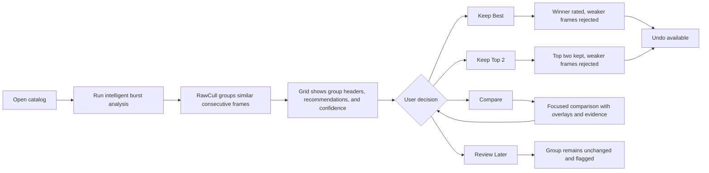

# RawCull New Feature Recommendation: Apple-Native Intelligent Burst Culling

Date: 2026-05-18
Scope: proposed production-quality enhancement for RawCull's existing similarity, burst grouping, sharpness scoring, focus mask, AF-point, and metadata pipeline.

## Executive Summary

The strongest next feature for RawCull is a production-grade **Apple-Native Intelligent Burst Culling** workflow.

RawCull already contains most of the technical building blocks:

- ImageIO-based RAW metadata and embedded preview access.
- Sony MakerNote focus-point extraction.
- Vision feature-print similarity indexing.
- Burst grouping over consecutive visually similar images.
- Core Image / Metal sharpness scoring.
- Vision saliency classification.
- SwiftUI comparison and culling grids.
- Swift Testing coverage for similarity behavior.

The opportunity is to turn these parts into a single polished workflow: RawCull groups near-duplicate burst sequences, evaluates the frames inside each group, explains why one frame is likely best, and gives the photographer fast, reversible actions such as **keep best**, **reject weaker frames**, **compare top candidates**, and **review uncertain groups**.

This is a better feature direction than generic filters or cosmetic image adjustments because it attacks the core pain of culling: photographers do not merely need to see images; they need to eliminate weaker near-duplicates quickly while keeping confidence that the true best frame was not thrown away.

## Why This Feature Belongs in RawCull

RawCull is not trying to be a general photo editor. Its advantage is fast, local, Apple-native evaluation of RAW files during culling. Intelligent burst culling fits that identity exactly.

Photographers shooting Sony A1 / A1 II files often produce long high-speed sequences. Many frames are visually close, but only one or two have the right combination of:

- critical focus,
- subject pose,
- eye/face/body placement,
- AF point alignment,
- motion blur control,
- exposure usability,
- camera settings context,
- and continuity inside the burst.

Manual review of those sequences is slow. Generic star-rating workflows do not solve the hard part because the user still has to inspect every frame. A RawCull-native burst workflow can reduce the number of decisions from "inspect 300 frames" to "review 40 groups and accept or override suggestions."

The key product promise should be:

> RawCull does not choose blindly. It groups similar frames, scores the evidence that matters for culling, explains the recommendation, and keeps the user in control.

## What the Current Imports Support

The import set below is directly relevant to this feature:

```swift
import CoreGraphics
import Foundation
import ImageIO
import CoreImage
import CoreImage.CIFilterBuiltins
```

### Foundation

Foundation supports the non-visual infrastructure:

- `URL`, `Data`, `FileManager` for catalog scanning and cache files.
- `Date`, `UUID`, and dictionaries for grouping and lookup.
- `JSONEncoder` / `JSONDecoder` for persisting analysis results.
- async tasks and cancellation-aware workflows.
- security-scoped file access and bookmark-backed persistence.

In this feature, Foundation is needed for group models, scoring result models, cache keys, progress state, persistence, and test fixtures.

### ImageIO

ImageIO is one of RawCull's most important advantages. It supports:

- `CGImageSourceCreateWithURL` for opening RAW containers.
- `CGImageSourceCopyPropertiesAtIndex` for EXIF and TIFF metadata.
- `CGImageSourceCreateThumbnailAtIndex` for embedded preview / thumbnail extraction.
- orientation-aware thumbnail creation.
- avoiding full RAW demosaic work when the embedded camera preview is enough for culling.

In this feature, ImageIO should continue to be the first-stage source for thumbnails, previews, EXIF settings, image dimensions, ISO, aperture, shutter speed, lens, camera model, and embedded JPEG access.

### CoreGraphics

CoreGraphics supplies the pixel and geometry types used throughout the pipeline:

- `CGImage` as the common image payload for ImageIO, Vision, Core Image, and SwiftUI rendering.
- `CGContext` for normalized bitmap rendering.
- `CGColorSpace` for predictable sRGB conversion.
- `CGPoint`, `CGSize`, and `CGRect` for AF point and focus-region geometry.

For intelligent burst culling, CoreGraphics should remain the bridge layer between low-level image decode, Vision requests, focus mask rendering, and UI overlays.

### CoreImage

Core Image supports fast image processing:

- `CIImage` and `CIContext`.
- Gaussian blur, sharpening, exposure, contrast, morphology, and color adjustment filters.
- Metal-backed rendering when configured correctly.
- custom kernels, as already used by `Kernels.ci.metal`.

RawCull already uses Core Image concepts in the sharpness and focus-mask pipeline. The new burst feature should use Core Image only where it improves culling evidence, not as a general editing stack.

### CoreImage.CIFilterBuiltins

`CoreImage.CIFilterBuiltins` provides typed Swift wrappers for Core Image filters. For example:

```swift
let filter = CIFilter.gaussianBlur()
filter.inputImage = image
filter.radius = 4
```

This is safer than stringly typed filters such as `CIFilter(name: "CIGaussianBlur")`, because it improves autocomplete, compile-time discoverability, and refactoring safety.

For RawCull, useful built-in filters include:

- `CIFilter.gaussianBlur()` for blur modeling and focus-mask preparation.
- `CIFilter.lanczosScaleTransform()` for high-quality downscaling.
- `CIFilter.colorControls()` for preview-only contrast/exposure inspection.
- `CIFilter.sharpenLuminance()` and `CIFilter.unsharpMask()` for diagnostic previews, not final scoring.
- morphology filters for cleaning focus-mask overlays.

## Recommended Feature

### Feature Name

**Apple-Native Intelligent Burst Culling**

### User-Facing Behavior

The user opens a catalog and runs analysis. RawCull then:

1. Computes or reuses embedded preview thumbnails.
2. Extracts EXIF metadata and Sony AF focus points.
3. Computes sharpness scores.
4. Computes Vision feature-print embeddings.
5. Groups consecutive visually similar frames into bursts.
6. Ranks frames inside each burst.
7. Shows the recommended best frame with a confidence indicator.
8. Lets the user compare, accept, reject, or override the recommendation.

The workflow should feel like culling assistance, not automation that takes control away from the photographer.

### Primary Actions

- **Group Bursts**: cluster consecutive visually similar frames.
- **Compare Group**: open a focused comparison view for the current group.
- **Keep Best**: rate the strongest frame as keeper and reject weaker frames.
- **Keep Top 2**: keep the two strongest candidates when confidence is lower.
- **Mark Uncertain**: leave the group untouched and flag it for manual review.
- **Exit Groups**: return to the normal flat grid.

### Recommendation Output

Each burst group should expose:

- recommended best frame,
- second-best frame,
- confidence level,
- sharpness score,
- similarity spread,
- AF-point alignment quality,
- saliency subject match,
- aperture / ISO context,
- group size,
- and whether RawCull thinks the group is safe for one-click culling.

## Why This Is Better Than a Generic Similarity Feature

Simple similarity sorting answers: "Which images look like this one?"

Intelligent burst culling answers: "Inside this repeated shooting sequence, which frames should I keep, which are weaker, and how confident is that recommendation?"

That second question is much more valuable for real culling.

RawCull should avoid becoming a generic "find similar photos" tool. The feature should be culling-specific:

- sequence-aware,
- metadata-aware,
- focus-aware,
- confidence-aware,
- reversible,
- and optimized for high-volume RAW review.

## Competitive Advantage Over Multi-Platform Culling Apps

RawCull can build a substantial advantage because it is Apple-framework-first instead of cross-platform-framework-first.

### 1. Native RAW and Metadata Access Through ImageIO

Multi-platform apps often rely on cross-platform image libraries, external RAW decoders, bundled metadata parsers, or abstraction layers. Those layers can be powerful, but they also add complexity and may not track macOS platform behavior as tightly.

RawCull can use ImageIO directly for:

- fast embedded preview access,
- EXIF / TIFF metadata,
- orientation transforms,
- Apple-managed image decoding,
- memory-efficient thumbnail creation,
- and native color-management behavior.

This matters because culling does not always need a full demosaic. For many decisions, the embedded camera JPEG plus accurate metadata is the fastest useful representation.

### 2. Vision Feature Prints Are Local, Fast, and System-Optimized

RawCull already uses `VNGenerateImageFeaturePrintRequest`. That gives it a native similarity representation without shipping a third-party ML model or calling a cloud service.

Advantages:

- local-only privacy,
- no network dependency,
- no model download workflow,
- Apple Silicon optimization,
- tight integration with `CGImage`,
- and easy composition with other Vision signals such as saliency.

Many cross-platform apps need to solve model packaging, GPU backend support, CPU fallback, and OS-specific acceleration separately. RawCull can let Apple maintain that stack.

### 3. Metal and Core Image Are First-Class on Apple Silicon

RawCull can use Core Image and Metal as primary tools rather than optional acceleration paths.

For sharpness scoring and focus masks, that matters because image analysis is expensive. A cross-platform implementation may need separate GPU paths for Metal, CUDA, Vulkan, DirectML, or CPU fallback. RawCull can concentrate quality effort on one hardware family: Apple Silicon.

That narrower target can produce a better experience:

- less duplicated code,
- fewer platform-specific compromises,
- more predictable performance,
- better thermal and memory tuning,
- and a UI that stays responsive under load.

### 4. Sony-Specific AF Point Parsing Is a Real Differentiator

RawCull already parses Sony MakerNote focus-point data. This is a large advantage for Sony A1 / A1 II users because culling is not only visual similarity. Focus location matters.

A high-quality recommendation can ask:

- Was the AF point on the subject?
- Is the sharpest region near the expected AF point?
- Did the focus mask agree with the camera focus location?
- Are we rejecting a frame that has better pose but missed focus?

Generic culling apps may score sharpness globally or use face/eye detection, but camera-specific AF context can make RawCull recommendations feel more trustworthy for its target audience.

### 5. SwiftUI Can Make the Workflow Feel Native

The feature can be exposed through a native macOS interface:

- keyboard-first review,
- efficient grids,
- comparison panes,
- real-time toggles,
- native toolbars,
- focus and zoom overlays,
- and safe reversible rating actions.

This matters because culling is repetitive. A small reduction in friction per group becomes a large time saving over a whole shoot.

## What It Takes To Implement Solid Quality

This feature should not be added as a thin UI around the current burst grouping. It needs a quality bar high enough that users can trust it.

### 1. A Strong Grouping Model

Current grouping is based on sequential Vision feature-print distance with a threshold. That is a good starting point, but production quality should add more evidence.

Recommended group boundaries should consider:

- visual feature distance between adjacent frames,
- capture order,
- capture timestamp if available,
- filename sequence continuity,
- camera body consistency,
- lens/focal length consistency,
- exposure setting jumps,
- and maximum allowed time gap.

This prevents accidental grouping when two different scenes happen to look similar, and prevents over-splitting a real burst when one frame has motion blur or slightly different composition.

Recommended implementation:

- Introduce a `BurstGroupingModel` or expand `SimilarityScoringModel` with a pure grouping helper.
- Use a `BurstGroupingConfig` value type.
- Make grouping deterministic and testable without UI.
- Store per-boundary evidence, not just final groups.

Example model:

```swift
struct BurstGroupingConfig: Sendable, Equatable {
    var visualDistanceThreshold: Float
    var maxTimeGapSeconds: Double
    var requireSameCamera: Bool
    var requireSimilarFocalLength: Bool
    var maxFocalLengthDeltaMM: Double
}

struct BurstBoundaryEvidence: Sendable, Equatable {
    var previousID: UUID
    var currentID: UUID
    var visualDistance: Float?
    var timeGapSeconds: Double?
    var focalLengthDelta: Double?
    var exposureChanged: Bool
    var startsNewGroup: Bool
}
```

### 2. A Real Best-Frame Ranking Model

The current `keepBestInGroup` uses the highest sharpness score and falls back to the first file. That is simple and useful, but production quality should rank by a blended culling score.

Recommended ranking signals:

- sharpness score,
- sharpness percentile within the group,
- AF-point alignment,
- saliency subject confidence / category consistency,
- similarity to the group center,
- exposure metadata sanity,
- ISO-aware noise penalty,
- aperture-aware blur tolerance,
- and optional user preference profile.

The result should be explainable. The user does not need a scientific report in the UI, but the app should be able to show concise reasons:

- "Sharpest in group"
- "AF point near focused region"
- "Subject category matches group"
- "Second frame close; review recommended"

Example model:

```swift
struct BurstCandidateScore: Sendable, Equatable {
    var fileID: UUID
    var overallScore: Float
    var sharpnessComponent: Float
    var focusPointComponent: Float
    var saliencyComponent: Float
    var metadataComponent: Float
    var confidence: BurstDecisionConfidence
    var reasons: [String]
}

enum BurstDecisionConfidence: String, Sendable, Codable {
    case high
    case medium
    case low
}
```

### 3. Confidence Before Automation

One-click culling must be conservative. RawCull should not aggressively reject frames when evidence is ambiguous.

High confidence might require:

- best frame clearly above second-best score,
- group contains at least three frames,
- similarity spread is tight,
- no major exposure or focal length jump,
- sharpness score is available,
- and AF/saliency evidence does not contradict the winner.

Low confidence should trigger review rather than auto-reject.

Recommended behavior:

- High confidence: show "Keep Best" as the primary action.
- Medium confidence: suggest "Compare Top 2".
- Low confidence: mark group as "Review".

This quality gate is important. A culling app earns trust by being careful when it is unsure.

### 4. Persistent Analysis Cache

For large catalogs, recomputing embeddings and scores is frustrating. RawCull already has disk thumbnail caching; intelligent culling should also persist analysis results.

Recommended cache contents:

- Vision feature-print data,
- sharpness scores,
- saliency labels,
- burst group results,
- candidate rankings,
- source file path,
- file size,
- modification date,
- algorithm version,
- RawCull app version.

Invalidation should happen when:

- file size changes,
- modification date changes,
- algorithm version changes,
- thumbnail size or scoring config changes,
- or the cache schema version changes.

This makes the feature feel fast after first analysis and avoids wasting Apple Silicon performance on repeated work.

### 5. Performance and Cancellation Quality

The feature must remain responsive on large catalogs. Required behavior:

- indexing, scoring, grouping, and ranking must be cancellable;
- partial progress should be visible;
- UI state must not be updated by stale tasks;
- expensive Vision unarchiving should not run repeatedly during slider drags;
- results should be applied only from the latest generation;
- and memory use must stay bounded.

Current known improvement areas:

- Similarity indexing currently accumulates local embeddings and merges only at the end. For long runs, cancellation can discard completed work. A production implementation should merge incrementally or periodically flush partial results.
- Burst grouping currently unarchives stored Vision observations for each grouping run. A production implementation should cache unarchived observations for the current embeddings snapshot and invalidate that cache when embeddings change.

These are not blockers for experimentation, but they should be fixed before calling the workflow solid.

### 6. UI Quality Requirements

The UI should be fast and calm. Avoid adding a large modal-heavy workflow.

Recommended UI:

- group headers in the similarity grid;
- best-frame badge;
- confidence badge;
- compact reason text;
- "Keep Best", "Keep Top 2", "Compare", and "Review" actions;
- keyboard shortcuts for repeated decisions;
- comparison view focused on group candidates;
- focus mask and AF-point overlay toggles available during comparison;
- visible progress for scoring/indexing/grouping;
- clear cancel actions.

The user should always be able to undo or override the recommendation. Ratings should remain the source of truth rather than hidden auto-delete state.

### 7. Testing Requirements

This feature needs more than happy-path tests.

Add Swift Testing coverage for:

- grouping empty file lists;
- grouping one file;
- grouping by visual threshold;
- grouping with missing embeddings;
- grouping with timestamp gaps;
- grouping with focal length or exposure changes;
- ranking when all scores exist;
- ranking when sharpness is missing;
- high/medium/low confidence classification;
- keep-best action rating the winner and rejecting losers;
- no stale task applying old grouping results;
- cancellation preserving completed cached work where intended;
- cache invalidation on file size/date/config changes;
- and persistence decode compatibility across schema versions.

Recommended tags:

- `@Tag.smoke` for pure grouping and ranking tests.
- `@Tag.critical` for keep/reject behavior and cache invalidation.
- `@Tag.performance` for large-catalog grouping and indexing.
- `@Tag.threadSafety` for cancellation and generation-token behavior.

### 8. Acceptance Criteria

Do not ship the feature as "done" until these are true:

- A 1,000-file catalog can be indexed and grouped without UI hangs.
- Cancelling indexing or grouping leaves the app in a coherent state.
- Re-running grouping with a changed threshold does not leak stale results.
- Existing ratings are not overwritten without explicit user action.
- "Keep Best" is reversible through the normal rating model.
- The best-frame recommendation is explainable.
- Low-confidence groups are not auto-rejected.
- Results are deterministic for the same catalog and settings.
- Smoke tests pass.
- Full tests pass with Thread Sanitizer.
- Memory does not grow unbounded during repeated grouping.

## Implementation Roadmap

### Phase 1: Stabilize Existing Similarity and Grouping

Goal: make the current foundation more robust.

Tasks:

- Incrementally merge similarity embeddings during indexing.
- Cache unarchived `VNFeaturePrintObservation` values for the current embeddings snapshot.
- Add generation tokens to all async result application paths that do not already have them.
- Add pure tests for grouping and cancellation behavior.
- Make group boundary evidence available for debugging.

Expected value:

- faster regrouping,
- better cancellation behavior,
- less lost work,
- and clearer correctness tests.

### Phase 2: Add Best-Frame Ranking

Goal: replace "sharpest only" with a blended, explainable group ranking.

Tasks:

- Add `BurstCandidateScore`.
- Compute per-frame group rank from sharpness, AF point, saliency, and metadata.
- Add confidence classification.
- Surface the best and second-best candidates.
- Add tests for ranking and confidence.

Expected value:

- recommendations become more trustworthy,
- ambiguous groups are handled safely,
- and RawCull starts to feel meaningfully smarter than generic similarity tools.

### Phase 3: Add Production UI

Goal: make the workflow fast for real users.

Tasks:

- Add group headers with best-frame and confidence information.
- Add "Keep Best", "Keep Top 2", "Compare", and "Review" actions.
- Add keyboard shortcuts.
- Add comparison workflow integration.
- Show concise recommendation reasons.
- Ensure existing rating filters and sorting still behave correctly.

Expected value:

- fewer clicks,
- faster review,
- better confidence,
- and a clear reason for users to prefer RawCull over general catalog apps.

### Phase 4: Persist Analysis Results

Goal: avoid recomputing expensive work.

Tasks:

- Add analysis cache schema.
- Include algorithm and settings versioning.
- Invalidate by source file size / modification date.
- Persist embeddings, scores, saliency labels, and ranking results.
- Add migration and compatibility tests.

Expected value:

- large catalogs become pleasant to reopen,
- repeated sessions feel instant,
- and expensive Apple-native analysis is amortized.

### Phase 5: Tune With Real Shoots

Goal: make the feature photographically correct, not just technically correct.

Tasks:

- Test with bird-in-flight bursts.
- Test with landscapes and static scenes.
- Test with high ISO and slow shutter speeds.
- Test with subject entering/leaving frame.
- Test with focus point missing or unreliable.
- Tune thresholds by genre profile.

Expected value:

- fewer false recommendations,
- better confidence thresholds,
- and stronger product credibility.

## Recommended Architecture

### Keep the ViewModel Thin

`RawCullViewModel` should coordinate actions, but the ranking and grouping logic should be testable outside SwiftUI.

Recommended structure:

- `SimilarityScoringModel`: owns embeddings, similarity distances, indexing state.
- `BurstGroupingEngine`: pure grouping logic from file metadata and feature distances.
- `BurstRankingEngine`: pure best-frame scoring and confidence logic.
- `BurstAnalysisCache`: actor responsible for persisted analysis artifacts.
- `RawCullViewModel+BurstGrouping`: user actions and state coordination.
- `SimilarityGridSelectionView`: controls and display only.

This keeps the feature easier to test and prevents a very large ViewModel extension from becoming the only place the logic can live.

### Use Value Types For Decisions

Store decisions in value types:

```swift
struct BurstAnalysisResult: Sendable, Equatable {
    var groupID: Int
    var fileIDs: [UUID]
    var candidates: [BurstCandidateScore]
    var recommendedFileID: UUID?
    var confidence: BurstDecisionConfidence
}
```

Value types make testing, persistence, and comparison easier.

### Keep Heavy Work Off The Main Actor

Because `SWIFT_DEFAULT_ACTOR_ISOLATION = MainActor`, every new type must be explicit about isolation.

Recommended rules:

- pure helper engines should be `nonisolated` or free of MainActor state;
- long-running work should use actors or detached tasks carefully;
- no ImageIO decoding should happen in SwiftUI view bodies;
- no Vision unarchiving loops should run on the MainActor;
- UI state updates should happen on MainActor only after cancellation checks.

This is essential for Swift 6 strict concurrency and a smooth macOS UI.

## Risks And Mitigations

### Risk: Wrong Auto-Rejections

Mitigation:

- make auto-reject explicit, not automatic after analysis;
- require high confidence for one-click reject actions;
- keep ratings reversible;
- and show "Review" for uncertain groups.

### Risk: Performance Regression On Large Catalogs

Mitigation:

- bounded concurrency;
- cached embeddings and observations;
- progress reporting;
- cancellation;
- performance tests;
- and memory diagnostics.

### Risk: Overfitting To One Shoot Type

Mitigation:

- support genre profiles later, such as birds, sports, portraits, and landscape;
- tune thresholds against real shoots;
- and keep user-adjustable sensitivity controls.

### Risk: UI Complexity

Mitigation:

- add actions where the user already works: grid headers and comparison view;
- avoid separate wizard flows;
- keep controls compact;
- and make keyboard operation first-class.

## My Recommendation

Implement **Apple-Native Intelligent Burst Culling** as RawCull's next flagship workflow.

The first implementation should not try to do everything. Start by hardening current similarity grouping, then add explainable best-frame ranking. Once that foundation is reliable, expose a focused UI for acting on groups quickly.

The minimum solid version should include:

- stable burst grouping,
- best-frame and second-best ranking,
- confidence classification,
- explainable reasons,
- safe actions,
- cancellation-safe async behavior,
- and Swift Testing coverage.

The most important quality principle is conservatism: RawCull should be bold in helping the user find the best frame, but cautious about rejecting images when the evidence is weak.

If implemented to this bar, this feature gives RawCull a real differentiated advantage over multi-platform culling apps: it combines Apple-native RAW access, Vision similarity, Core Image / Metal sharpness analysis, Sony AF-point parsing, and a native macOS workflow into a specialized culling assistant rather than a generic image browser.

---

## Document Mockup: How Intelligent Burst Culling Should Work

This mockup describes the user-facing workflow before any implementation details. It is intentionally document-based so the interaction model can be reviewed, adjusted, and tested against real culling habits before building production UI.

The core experience should feel like this:

> RawCull finds repeated burst sequences, recommends the strongest frame, explains the evidence, and gives the photographer fast reversible choices.

The user should never feel that RawCull is secretly deleting or rejecting images. Analysis creates suggestions. The user applies decisions.

### Mockup Goals

- Show burst groups directly where the user already reviews images.
- Make the recommended frame obvious without hiding alternatives.
- Explain recommendations in short, photographic language.
- Make high-confidence decisions fast.
- Push low-confidence decisions toward manual review.
- Keep all actions reversible through the normal rating model.
- Avoid a separate wizard or modal-heavy flow.

### End-To-End User Journey



### Main Interaction States

#### State 1: Before Analysis

The user has opened a catalog. The similarity or culling grid behaves as it does today, but the toolbar offers a clear analysis entry point.

```text
+--------------------------------------------------------------------------------+
| RawCull                                      [Analyze Bursts] [Similarity] [...] |
+--------------------------------------------------------------------------------+
| Sidebar               | Grid                                                     |
|                       |                                                          |
| Catalog               |  DSC01201   DSC01202   DSC01203   DSC01204              |
| - 2026-05-18 Shoot    |  [thumb]    [thumb]    [thumb]    [thumb]               |
|                       |                                                          |
| Filters               |  DSC01205   DSC01206   DSC01207   DSC01208              |
| - All ratings         |  [thumb]    [thumb]    [thumb]    [thumb]               |
+--------------------------------------------------------------------------------+
```

Expected user action:

- Click **Analyze Bursts** when they want RawCull to find repeated sequences.
- Continue normal manual culling if they do not want assistance.

Design notes:

- The button should be compact and toolbar-native.
- It should not imply irreversible automation.
- A tooltip can clarify: "Group burst sequences and recommend best frames."

#### State 2: Analysis In Progress

RawCull shows progress without blocking normal orientation in the app. The user can cancel safely.

```text
+--------------------------------------------------------------------------------+
| RawCull                         Analyzing bursts... 248 / 1000 [Cancel]         |
+--------------------------------------------------------------------------------+
| Sidebar               | Grid                                                     |
|                       |                                                          |
| Catalog               |  DSC01201   DSC01202   DSC01203   DSC01204              |
| - 2026-05-18 Shoot    |  [thumb]    [thumb]    [thumb]    [thumb]               |
|                       |                                                          |
| Analysis              |  Current step: Sharpness scoring                         |
| Similarity  done      |  Next step: Grouping                                     |
| Sharpness   running   |                                                          |
| Grouping    waiting   |                                                          |
+--------------------------------------------------------------------------------+
```

Expected user action:

- Wait for analysis to complete.
- Cancel if the catalog is wrong or the user wants to change filters/settings.

Design notes:

- The progress state should say what is happening in plain language.
- Cancellation should leave already-loaded catalog state intact.
- If partial results are available, RawCull may show them, but should clearly label the run as incomplete.

#### State 3: Burst Groups In The Grid

After analysis, the grid becomes group-aware. Group headers summarize size, confidence, and the recommended action.

```text
+--------------------------------------------------------------------------------+
| RawCull                         Burst Groups: 42 groups  [Exit Groups] [...]    |
+--------------------------------------------------------------------------------+
| Sidebar               | Grid                                                     |
|                       |                                                          |
| Burst Review          |  Burst 12  | 8 frames | High confidence | Best: DSC01234 |
| - All groups          |  Reasons: Sharpest | AF aligned | Subject stable         |
| - High confidence     |  [Keep Best] [Keep Top 2] [Compare] [Review]             |
| - Needs review        |                                                          |
|                       |  DSC01231   DSC01232   DSC01233   DSC01234   DSC01235    |
|                       |  [thumb]    [thumb]    [thumb]    [BEST]    [thumb]     |
|                       |                                                          |
|                       |  Burst 13  | 5 frames | Medium confidence | Top 2 close  |
|                       |  Reasons: Best is sharper | Second frame close           |
|                       |  [Compare Top 2] [Keep Top 2] [Review]                  |
|                       |                                                          |
|                       |  DSC01241   DSC01242   DSC01243   DSC01244   DSC01245    |
|                       |  [thumb]    [BEST]    [2ND]     [thumb]    [thumb]      |
+--------------------------------------------------------------------------------+
```

Expected user action:

- For high-confidence groups, use **Keep Best** when the recommendation looks correct.
- For medium-confidence groups, use **Compare** or **Keep Top 2**.
- For low-confidence groups, use **Review** and leave ratings unchanged.

Design notes:

- The recommended frame should be visually obvious but not overwhelming.
- Confidence should change the primary action:
  - High confidence: **Keep Best**.
  - Medium confidence: **Compare Top 2**.
  - Low confidence: **Review**.
- Reason text must be short. Good examples:
  - "Sharpest in group"
  - "AF point near focused region"
  - "Subject stable"
  - "Second frame close"
  - "Exposure changed; review"

#### State 4: Best Frame Thumbnail Treatment

Each thumbnail keeps the normal image-first layout, with small overlays for ranking and rating status.

```text
+-----------------------+
| BEST        High       |
|                       |
|        thumbnail       |
|                       |
| DSC01234.ARW           |
| Score 92 | AF aligned  |
+-----------------------+
```

For a second-place candidate:

```text
+-----------------------+
| 2ND         Close      |
|                       |
|        thumbnail       |
|                       |
| DSC01233.ARW           |
| Score 88 | sharper pose|
+-----------------------+
```

For a rejected-after-action frame:

```text
+-----------------------+
| Rejected              |
|                       |
|        thumbnail       |
|                       |
| DSC01231.ARW           |
| Undo available         |
+-----------------------+
```

Expected user action:

- Click a thumbnail to select it as usual.
- Use existing rating controls for manual overrides.
- Double-click or press the compare shortcut to enter focused comparison.

Design notes:

- Thumbnail overlays should not cover the subject.
- "BEST" and "2ND" are enough for scanability.
- Full evidence belongs in the group header or comparison panel, not on every thumbnail.

#### State 5: Focused Group Comparison

The comparison view should show the top candidates, synchronized zoom, overlays, and a concise evidence panel.

```text
+--------------------------------------------------------------------------------+
| Burst 12 Comparison                 [Focus Mask] [AF Points] [JPEG/RAW Preview] |
+--------------------------------------------------------------------------------+
|                                                                                |
|  DSC01234.ARW - Recommended                  DSC01233.ARW - Second             |
| +----------------------------------+        +----------------------------------+ |
| |                                  |        |                                  | |
| |           image pane              |        |           image pane              | |
| |      focus mask / AF overlay      |        |      focus mask / AF overlay      | |
| |                                  |        |                                  | |
| +----------------------------------+        +----------------------------------+ |
|  Score 92 | Sharpness 95 | AF good          Score 88 | Sharpness 89 | AF ok     |
|                                                                                |
| Evidence                                                                       |
| - Recommended frame is the sharpest in the group.                              |
| - AF point is close to the focused region.                                     |
| - Second frame is close enough to review before rejecting.                     |
|                                                                                |
| [Keep Best] [Keep Top 2] [Mark Review] [Back To Group]                         |
+--------------------------------------------------------------------------------+
```

Expected user action:

- Toggle focus mask and AF points to inspect the recommendation.
- Zoom/pan to inspect eyes, subject detail, or motion blur.
- Apply **Keep Best**, **Keep Top 2**, or **Mark Review**.

Design notes:

- This view should reuse the existing comparison behavior where possible.
- The evidence panel should explain only the current group.
- The best candidate should be first, but the user must be able to select another winner.

#### State 6: Low-Confidence Group

Low-confidence groups must not push the user toward one-click rejection.

```text
+--------------------------------------------------------------------------------+
| Burst 18  | 4 frames | Low confidence | Review recommended                     |
| Reasons: Exposure changed | Focus evidence unclear | Best and second are close   |
| [Compare] [Mark Review]                                                             |
|                                                                                |
| DSC01310     DSC01311     DSC01312     DSC01313                                |
| [thumb]      [BEST?]      [2ND?]       [thumb]                                  |
+--------------------------------------------------------------------------------+
```

Expected user action:

- Compare manually.
- Mark the group for later review.
- Rate images manually if the recommendation is not useful.

Design notes:

- Avoid showing **Keep Best** as the primary action for low confidence.
- A tentative badge such as "BEST?" is safer than "BEST".
- Reason text should make the uncertainty clear.

#### State 7: Decision Applied

When the user applies an action, RawCull updates ratings but keeps the result reversible.

```text
+--------------------------------------------------------------------------------+
| Burst 12  | Decision applied: kept DSC01234, rejected 7 weaker frames [Undo]    |
| Reasons: Sharpest | AF aligned | Subject stable                                |
|                                                                                |
| DSC01231     DSC01232     DSC01233     DSC01234     DSC01235                   |
| [reject]     [reject]     [reject]     [keeper]     [reject]                   |
+--------------------------------------------------------------------------------+
```

Expected user action:

- Continue to the next group.
- Undo immediately if the action was wrong.
- Manually adjust ratings if needed.

Design notes:

- Ratings remain the source of truth.
- The app should not create hidden reject state outside the existing rating model.
- Undo should be nearby after bulk actions.

### Proposed Keyboard Model

The feature should support keyboard-first review because burst culling is repetitive.

```text
Right Arrow      Next frame or next group item
Left Arrow       Previous frame or previous group item
Return           Compare selected group
B                Keep Best for high-confidence group
2                Keep Top 2
R                Mark Review
U                Undo last burst action
Esc              Exit comparison or exit group mode
F                Toggle focus mask in comparison
A                Toggle AF points in comparison
```

Keyboard shortcuts should be discoverable in menus and tooltips, but the UI should not rely on the user memorizing them.

### Confidence-Driven UI Behavior

The same data should produce different UI emphasis depending on confidence:

| Confidence | Primary UI action | Secondary actions | Auto-reject allowed? |
|---|---|---|---|
| High | Keep Best | Compare, Keep Top 2, Review | Only after explicit click |
| Medium | Compare Top 2 | Keep Top 2, Keep Best, Review | Only after explicit click |
| Low | Review | Compare | No |

This keeps RawCull helpful without becoming reckless.

### Recommendation Explanation Pattern

Each recommendation should fit into a small evidence model:

```text
Recommended: DSC01234.ARW
Confidence: High

Why:
- Sharpest in group.
- AF point is near the focused region.
- Subject position is stable across the burst.

Caution:
- Second frame is close, but not sharper.
```

For low confidence:

```text
Recommended: DSC01311.ARW
Confidence: Low

Why:
- Slightly sharper than nearby frames.

Caution:
- Exposure changes inside the group.
- AF evidence is missing.
- Best and second-best scores are close.
```

### Minimal Fake Data For A SwiftUI Prototype

The first interactive prototype can use fake data. It does not need ImageIO, Vision, or real sharpness scoring.

```swift
struct MockBurstGroup: Identifiable, Equatable {
    let id: Int
    var title: String
    var confidence: MockBurstConfidence
    var recommendedFileName: String
    var secondFileName: String?
    var reasons: [String]
    var caution: String?
    var frames: [MockBurstFrame]
}

struct MockBurstFrame: Identifiable, Equatable {
    let id: UUID
    var fileName: String
    var rank: Int?
    var score: Int
    var rating: Int
    var isRejected: Bool
}

enum MockBurstConfidence: String {
    case high = "High"
    case medium = "Medium"
    case low = "Low"
}
```

Recommended prototype behavior:

- Render three groups: high confidence, medium confidence, and low confidence.
- Make **Keep Best**, **Keep Top 2**, **Compare**, **Review**, and **Undo** clickable.
- Use placeholder thumbnails or existing sample images.
- Do not connect to real ratings until the interaction feels correct.

### What To Validate With The Mockup

Before production implementation, use this mockup to answer these questions:

- Does the user immediately understand which frame RawCull recommends?
- Is the confidence level visible without feeling noisy?
- Are the reasons short enough to scan during real culling?
- Does **Keep Best** feel safe only when confidence is high?
- Does the comparison view make uncertainty easier to resolve?
- Can the user recover from a wrong bulk action quickly?
- Does the workflow still feel like RawCull, not a separate app inside RawCull?

### First Buildable Slice

The smallest useful prototype should include:

1. A fake burst-review grid with group headers.
2. Best and second-best badges.
3. Confidence-specific actions.
4. A fake comparison state for the top two candidates.
5. A reversible mock decision state.

That slice is enough to test the workflow before connecting it to real `BurstAnalysisResult`, real ratings, and the existing comparison grid.
