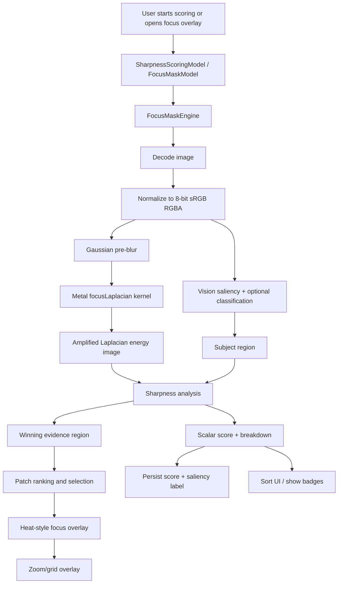
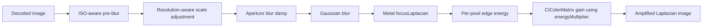
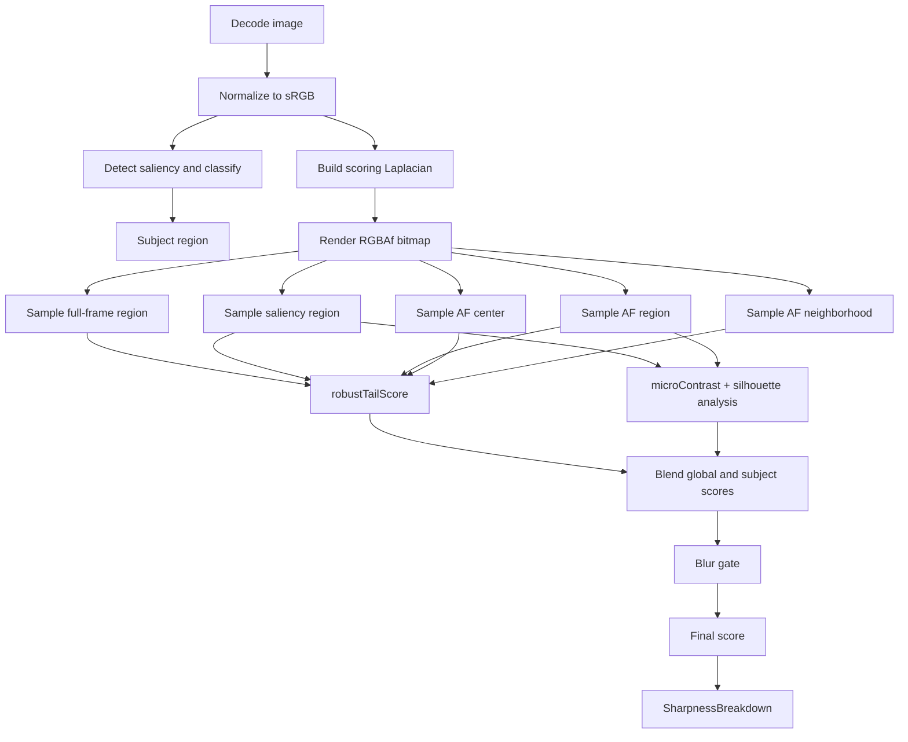
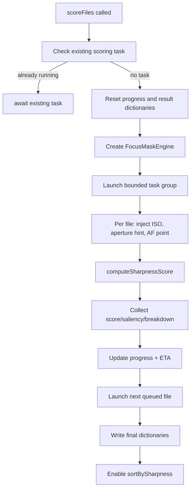
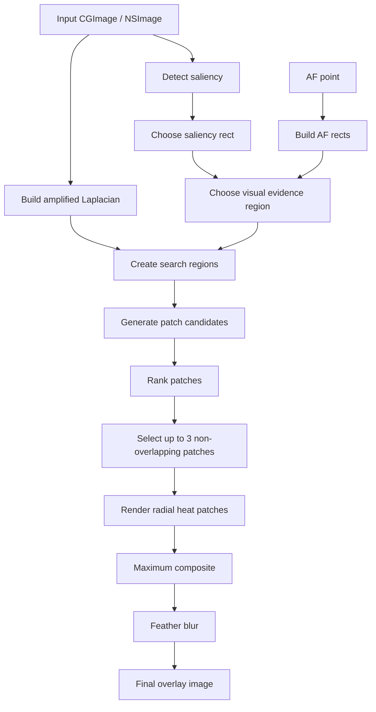
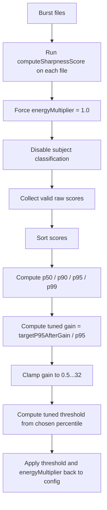

# Sharpness Scoring and Focus Masking in RawCull

This document describes the **current implementation in code** of RawCull's sharpness scoring and focus-mask overlay system.

The implementation lives in the `FocusandSharpness/` subdirectory and supporting views:

**Core model/engine — `RawCull/Model/ViewModels/FocusandSharpness/`**

| File | Contents |
|---|---|
| `FocusDetectorConfig.swift` | `FocusDetectorConfig` struct and `ApertureHint` extensions |
| `FocusMaskCalibration.swift` | `FocusMaskEngine` calibration extension (`calibrateFromBurstParallel`) |
| `FocusMaskEngine.swift` | Engine struct definition, `CIContext`, inner types |
| `FocusMaskEngine+Scoring.swift` | `computeSharpnessScore`, `buildAmplifiedLaplacian`, `robustTailScore` |
| `FocusMaskEngine+MaskGeneration.swift` | `generateFocusMask`, `buildFocusPeakingMask`, patch ranking, overlay rendering |
| `FocusMaskModel.swift` | `@Observable @MainActor` wrapper; thin async facade over `FocusMaskEngine` |
| `FocusMaskTypes.swift` | Shared value types: `SaliencyInfo`, `FocusFailureKind`, `FocusEvidence`, `SharpnessBreakdown`, `FocusPatchRanking`, enums |
| `FocusPointsModel.swift` | Sony AF focus-point reading |
| `SharpnessScoringModel.swift` | Batch scoring coordinator |
| `SharpnessScoringOptions.swift` | `SharpnessPhotoType`, `SharpnessScoringQuality`, `SharpnessScoringSource`, `SharpnessScoringSizeOption` |

**Other files**

- `RawCull/Model/ViewModels/RawCullViewModel+Sharpness.swift`
- `RawCull/Kernels.ci.metal`
- `RawCull/Views/ZoomViews/ZoomOverlayView.swift`
- `RawCull/Views/FocusPeek/FocusPeakingControlsView.swift`
- `RawCull/Views/ThumbnailComponents/ImageOverlayControlsView.swift`
- `RawCull/Views/GridView/SharpnessControlsView.swift`
- `RawCull/Views/Settings/FocusSettingsTab.swift`
- `RawCullTests/SharpnessScoringTests.swift`

---

## 1. What the system is trying to do

RawCull has two related but different features:

1. **Sharpness scoring**: produce one scalar score per file so a burst/catalog can be sorted by sharpness.
2. **Focus mask / focus evidence overlay**: draw an overlay showing where the app believes the strongest in-focus evidence lives.

They share the same core signal:

- decode an image
- normalize it to a predictable pixel format
- compute edge energy using a **Gaussian pre-blur + Metal Laplacian**
- use **Vision saliency** and optional **subject classification**
- combine that with the camera's **Sony AF point**

But they diverge after that:

- **Scoring** reduces image regions to scalar values and blends them.
- **Overlay rendering** ranks local patches and paints a heat-style overlay over the strongest evidence patches.

---

## 2. High-level architecture



---

## 3. Main types and responsibilities

| Type | Responsibility |
|---|---|
| `FocusMaskModel` | `@Observable @MainActor` wrapper that owns config and calls the background engine. |
| `FocusMaskEngine` | Pure/background image-analysis engine. Holds `CIContext` and runs the actual pipeline. |
| `SharpnessScoringModel` | Batch scoring coordinator, scoring presets/quality/source selection, progress, results, and UI normalization. |
| `FocusDetectorConfig` | Shared parameter bag for both scoring and overlay generation. |
| `SharpnessBreakdown` | Per-file diagnostics: final score, region scores, blur-gate sigma, subject info, failure classification, focus evidence. |
| `FocusEvidence` | Diagnostics for where the overlay was rendered and why. |
| `SaliencyInfo` | Vision-derived subject label and saliency confidence. |

Important architectural points:

- `SharpnessScoringModel` is `@MainActor`, but the heavy work runs inside detached/background tasks.
- `FocusMaskEngine` is a `struct` marked `@unchecked Sendable` because it owns a `CIContext`; the code treats it as immutable background infrastructure. Its implementation is split across `FocusMaskEngine+Scoring.swift`, `FocusMaskEngine+MaskGeneration.swift`, and `FocusMaskCalibration.swift`.
- `FocusMaskModel` is `@Observable @MainActor` and acts as a thin async facade over `FocusMaskEngine`. It does not run heavy work itself — it forwards to engine methods via `async let` / `await`.
- `FocusMaskModel` and `SharpnessScoringModel` share the same config vocabulary via `FocusDetectorConfig`, but not every config field currently affects both paths equally.
- `SharpnessScoringOptions.swift` contains all options enums (`SharpnessPhotoType`, `SharpnessScoringQuality`, `SharpnessScoringSource`, `SharpnessScoringSizeOption`) that were previously inline in `SharpnessScoringModel`.

---

## 4. Input image sources

Sharpness scoring can analyze two sources:

| Source | Code path | Notes |
|---|---|---|
| `embeddedPreview` | `decodeBinaryFallback` -> `decodeThumbnail` | Default. Uses Sony's embedded JPEG preview and is the normal culling path. |
| `rawDemosaic` | `decodeDemosaicedRawThumbnail` | Uses `CIRAWFilter`. Slower and concurrency-limited. |

### Embedded preview path

For the default path, the engine tries:

1. **Sony binary fallback first** for Sony raw formats:
   - `SonyMakerNoteParser.embeddedJPEGLocations(from:)`
   - read embedded JPEG bytes directly
   - decode the JPEG
2. If that fails, fall back to:
   - `CGImageSourceCreateThumbnailAtIndex`

This is specifically there for newer Sony RAW variants where standard thumbnail decode can return `nil`.

### RAW demosaic path

`decodeDemosaicedRawThumbnail` uses `CIRAWFilter`, with:

- `sharpnessAmount = 0.0`
- `detailAmount = 0.6`
- `contrastAmount = 1.0`
- `exposure = 0.0`

Then it scales the image down to the requested max size and renders through the engine's `CIContext`.

### Pixel normalization

After decode, images are normalized with `normalizeToSRGB(_:)`:

- drawn into an **8-bit sRGB premultiplied RGBA** `CGContext`
- returned as a new `CGImage`

This guarantees the Metal/Core Image stages receive a predictable format regardless of source JPEG colorspace or bit depth.

---

## 5. Saliency and subject classification

The Vision phase is handled by `detectSaliencyAndClassify(for:classify:)`.

It runs:

- `VNGenerateAttentionBasedSaliencyImageRequest`
- optionally `VNClassifyImageRequest`

### Saliency acceptance rules

The code only accepts a saliency result if:

- there is at least one salient object, and
- either:
  - the union area is greater than `0.03` of the image, or
  - the max confidence is at least `0.9`

So weak or tiny saliency observations are discarded instead of silently biasing scoring.

### Classification label selection

Classification is not a raw "top label wins" system.

`bestClassificationLabel(from:)` uses heuristics:

1. Prefer labels matching subject-like tokens such as:
   - `bird`, `animal`, `person`, `portrait`, etc.
2. Otherwise accept a reasonably confident label that is **not** obviously environment-only, such as:
   - not `tree`, `grass`, `landscape`, `background`, `texture`, etc.

This gives the app a more useful subject badge than a generic scene label.

---

## 6. Core edge-energy pipeline

The shared image-energy pipeline is in `buildAmplifiedLaplacian(from:config:)`.



### 6.1 Pre-blur radius

The effective blur radius is:

`preBlurRadius * isoFactor * resFactor * blurDamp`

Where:

- `isoFactor` comes from `isoScalingFactor(iso:)`
- `resFactor = clamp(sqrt(max(width, 512) / 512), 1, 3)`
- `blurDamp = 0.8` for landscape apertures, otherwise `1.0`
- final radius is capped at `100`

### 6.2 ISO scaling

The ISO scaling is piecewise:

- `< 800` -> `1.0`
- `800 ..< 3200` -> ramps to `1.6`
- `>= 3200` -> ramps to `2.2` cap

This is intentionally gentler than the earlier `sqrt(iso / 400)` style approach, because the code comments note Sony A1-series files remain relatively clean and do not need overly aggressive blur at higher ISO.

### 6.3 Metal kernel

The custom kernel is `focusLaplacian` in `Kernels.ci.metal`.

It computes:

- 3x3 discrete Laplacian
- absolute RGB Laplacian magnitude
- converts to a single luminance-like scalar using:
  - `0.299 R + 0.587 G + 0.114 B`

So every output pixel becomes a scalar edge-energy value packed into RGB.

In code terms:

- strong local second-derivative change -> high value
- smooth/blurred areas -> near zero

### 6.4 Energy amplification

After the Laplacian pass, `CIColorMatrix` scales RGB using `config.energyMultiplier`.

This is the gain that calibration adjusts.

---

## 7. Sharpness scoring pipeline

The scalar scoring logic is in:

- `computeSharpnessScore(...)`
- `computeSharpnessBreakdown(...)`
- `computeSharpnessAnalysis(...)`
- `robustTailScore(...)`



### 7.1 Region sampling

The engine renders the amplified Laplacian into an `RGBAf` bitmap and reads the `.r` channel as the scalar edge-energy signal.

It then collects sample sets for:

1. **Full frame**
   - inside the border inset
   - excludes Gaussian edge artifacts
2. **Saliency region**
   - Vision bounding-box union, if present
3. **AF point region**
   - square centered on `afFocusNormalized`
4. **AF center region**
   - a tighter AF-local square
5. **AF neighborhood region**
   - an intermediate AF-local square

Default radii:

- `afRegionRadius = 0.12`
- `afCenterRegionRadius = 0.025`
- `afNeighborhoodRegionRadius = 0.075`

The AF point comes from `FileItem.afFocusNormalized`, documented in code as:

- normalized `0...1`
- origin **top-left**
- sourced from Sony MakerNote parsing

The saliency region needs a coordinate flip when sampling because Vision and Core Image/image rendering do not use the same Y-origin convention.

### 7.2 `robustTailScore`

This is the core scalar reduction function.

For a sample set:

1. sort values with Accelerate `vDSP.sort`
2. compute:
   - `p20`
   - `p90`
   - `p97`
3. collect all samples in the `p90...p97` band
4. subtract the `p20` noise floor from each
5. average the adjusted band
6. apply a density penalty if fewer than roughly `6%` of pixels land in the band

So the score is roughly:

- "strong upper-tail edge energy"
- minus a noise floor
- penalized when strong edges are too sparse

This is why the scoring is more robust than simple max, mean, or raw Laplacian variance.

### 7.3 Subject score blending

The code forms an effective subject score as:

- `0.6 * AF + 0.4 * saliency` when both exist
- AF only if only AF exists
- saliency only if only saliency exists

This is a deliberate design choice in code comments:

- AF says where the camera attempted focus
- saliency says where the perceptual subject appears to be

Blending avoids AF always overriding saliency.

### 7.4 Full-frame vs subject blend

If both full-frame and subject scores exist:

`finalBase = full * (1 - w) + subject * w`

Where:

- `w = explicitSalientWeightOverride ?? apertureHint.salientWeightOverride ?? salientWeight`

This means subject weighting can come from:

1. photo-type preset override
2. aperture-aware landscape override
3. baseline config

### 7.5 Penalties and bonuses

After blending, the score may be adjusted by:

#### Silhouette penalty

If too much subject-region energy lives in the outer border, the code interprets that as a silhouette/rim-light case instead of interior subject detail.

- threshold starts at border fraction `0.62`
- penalty strength default is `0.55`

#### Subject-size bonus

If the score is using a saliency region **without** AF anchoring:

- multiply by `1 + area * subjectSizeFactor`

This mildly rewards a larger salient subject.

#### Missing-subject penalty

If there is a full-frame score but no subject region:

- the score is penalized with a cube of `(1 - salientWeight)`

This is intentionally harsh in wildlife-first usage, because "no detected subject" is often a bad sign for a frame the app cares about.

### 7.6 Blur gate

The final stage applies a **soft blur gate** driven by `microContrast` (standard deviation of region sample values).

This uses aperture-dependent thresholds:

| Aperture hint | `blurGateLow` | `blurGateHigh` |
|---|---:|---:|
| `wide` | 0.010 | 0.025 |
| `mid` | 0.008 | 0.022 |
| `landscape` | 0.006 | 0.018 |

Behavior:

- below low threshold -> multiplier near `0.20`
- above high threshold -> multiplier `1.0`
- in between -> linear ramp

This replaced an older hard cutoff and is explicitly meant to reduce false negatives on low-contrast but still acceptably focused subjects.

### 7.7 Focus failure classification

The engine classifies the breakdown into:

- `.none`
- `.motionBlur`
- `.missedFocus`

Rules:

#### Motion blur

If all meaningful scores are low and blur-gate sigma is also low:

- score thresholds around `0.08`
- sigma threshold `0.012`

#### Missed focus

If global detail exists but subject detail is much weaker:

- global score >= `0.12`
- subject/global ratio < `0.55`

So:

- **motion blur** = little usable detail anywhere
- **missed focus** = detail exists, but not where subject focus should be

---

## 8. Fine-detail pass and quality modes

Scoring uses `buildScoringLaplacian`, not always just the primary Laplacian.

If `fineDetailBlendWeight > 0`, the engine creates:

1. the normal Laplacian pass
2. a second pass with smaller pre-blur (`preBlurRadius * 0.58`, floored at `0.35`)
3. blends them

This preserves finer details like:

- feathers
- eyelashes
- eyes
- thin local structure

### Quality presets

| Quality | Min decode size | Max concurrency | Fine-detail blend |
|---|---:|---:|---:|
| `fast` | 512 | 6 | 0.0 |
| `balanced` | 768 | 4 | 0.25 |
| `highPrecision` | 1024 minimum, default 2048 in UI | 3 | 0.45 |

If the source is `rawDemosaic`, concurrency is capped to `2`.

### Thumbnail size option

`SharpnessScoringSizeOption` encodes the three selectable sizes for high-precision scoring:

| Case | Pixel size |
|---|---:|
| `.px1024` | 1024 |
| `.px1536` | 1536 |
| `.px2048` | 2048 |

`SharpnessScoringSizeOption.highPrecisionDefaultPixelSize` is `2048` (the default for high-precision mode in the UI).

`SharpnessScoringSizeOption.normalizedPixelSize(_:for:)` enforces that the chosen pixel size is never below the quality preset's `minimumThumbnailMaxPixelSize` — so a user cannot accidentally score at 1024 px while `highPrecision` mode requires at least 1024 as a floor.

---

## 9. Photo-type presets

`SharpnessPhotoType` adjusts the config before scoring.

| Photo type | Main effect |
|---|---|
| `auto` | Use the current `focusMaskModel.config` as-is. |
| `birdsWildlife` | Strong subject weighting, smaller AF region, more subject isolation. |
| `portrait` | Strong subject weighting, larger AF region, softer silhouette penalty. |
| `landscape` | Lower subject weighting, no AF region emphasis, no subject isolation. |
| `generalAction` | Moderate subject weighting and AF emphasis. |

Examples from code:

- wildlife: `explicitSalientWeightOverride = 0.85`, `afRegionRadius = 0.06`
- portrait: `explicitSalientWeightOverride = 0.80`, `afRegionRadius = 0.10`
- landscape: `explicitSalientWeightOverride = 0.35`, `afRegionRadius = 0.0`, `isolateMaskToSubject = false`

---

## 10. Batch scoring orchestration

`SharpnessScoringModel.scoreFiles(_:)` handles batch runs.



Important details:

- per-file config is copied and then filled with:
  - `iso`
  - `apertureHint`
  - `afPoint`
- results are accumulated locally and only written back once the run finishes cleanly
- if cancelled, results are discarded
- progress ETA starts after enough samples have completed

### Score normalization for badges

`SharpnessScoringModel.maxScore` is not always the raw max:

- `< 2` scores -> use the only score or `1.0`
- `< 10` scores -> use the raw max
- `>= 10` scores -> use the **90th percentile**

That keeps one extreme outlier from collapsing every other badge toward zero.

This behavior is covered by `RawCullTests/SharpnessScoringTests.swift`.

---

## 11. Focus mask overlay pipeline

The current overlay path is **not** a simple binary thresholded mask anymore.

It is now an **evidence-patch ranking and heat overlay system**.



### 11.1 Region selection

`focusMaskRegionSelection(...)` builds:

- `saliencyRect`
- `afRect`

And tags the source as:

- `.none`
- `.saliency`
- `.afPoint`
- `.saliencyAndAF`

### 11.2 Choosing the visual evidence region

The overlay tries to respect the scoring breakdown's winning region:

- `afCenter`
- `afNeighborhood`
- `afPoint`
- `saliency`
- `mixed`
- `global`

If no requested region is usable, it falls back to:

1. AF point if available
2. saliency if available
3. global otherwise

### 11.3 Patch generation

Within the chosen search region, the engine creates many candidate rectangles.

Patch sizes are proportional to region and image size, with caps/floors so they do not become absurdly small or large.

If an AF point exists, it also explicitly adds an AF-centered candidate patch.

### 11.4 Patch ranking

Each patch is scored with a composite made from:

- `robustTailScore`
- `microContrast`
- thresholded coverage estimate
- AF proximity
- interior bonus
- silhouette penalty
- shape heuristics

Shape heuristics include:

- `ringDetailScore`
- `compactDetailScore`
- `linearEdgePenalty`
- `belowAFPenalty`
- `eyeHeadHeuristicAdjustment`

The code is clearly trying to prefer:

- compact interior detail
- eye/head-like or locally concentrated structure
- patches close to AF when AF anchoring matters

And avoid:

- long linear high-contrast junk
- border-only silhouette rims
- patches suspiciously far below the AF point in AF-driven contexts

### 11.5 Patch selection

`selectEvidencePatches(...)`:

- sorts viable patches by composite score
- for AF-anchored cases, may promote the nearest AF patch if it is close enough in strength
- selects up to **3** patches
- rejects overlapping patches above overlap ratio `0.55`

### 11.6 Rendering

Selected patches are rendered as radial gradients:

- `subjectHeat` style for subject-focused overlays
- `globalDetail` style for full-frame/global overlays

Then:

1. all heat patches are maximum-composited together
2. optional feather blur is applied using `config.featherRadius`
3. result is returned as a `CGImage`

This is why the overlay today behaves more like a **localized heatmap of best focus evidence** than an old-school binary focus peaking mask.

---

## 12. Focus peaking

Focus peaking is a separate per-pixel overlay distinct from the heatmap-style focus evidence overlay.

### What it is

Focus peaking highlights every above-threshold pixel across the whole frame in bright green — it is a **pixel-level binary edge mask**, not a region-ranked heatmap.

### Pipeline

`FocusMaskEngine.buildFocusPeakingMask(from:config:context:)` in `FocusMaskEngine+MaskGeneration.swift`:

1. `buildAmplifiedLaplacian` — same Gaussian pre-blur + Metal Laplacian + gain as the scoring path, but applied to the full frame with no region restriction.
2. `CIColorMatrix` — copies the R channel into R/G/B so `CIColorThreshold` sees a greyscale signal.
3. `CIColorThreshold` — outputs `1.0` where energy ≥ `config.threshold`, `0.0` elsewhere.
4. `CIMorphologyMinimum` (erosion with `config.erosionRadius`) — removes isolated noise pixels.
5. `CIMorphologyMaximum` (dilation with `config.dilationRadius`) — slightly expands surviving edge pixels.
6. `CIColorMatrix` — maps the binary value to a bright green tint; sets alpha = binary value so non-sharp pixels are fully transparent.

### Entry point

`FocusMaskModel.generateFocusPeakingMask(from:configOverride:)` is the async facade used by the UI.

In `ZoomOverlayView`, the focus evidence mask and the peaking mask are generated **concurrently** via `async let`:

```swift
async let maskResult = focusMaskModel.generateFocusMaskWithBreakdown(...)
async let peakingResult = focusMaskModel.generateFocusPeakingMask(from: source, configOverride: config)
let (result, peaking) = await (maskResult, peakingResult)
```

### UI

- Toggled with keyboard shortcut **`g`** (`ZoomOverlayKeyAction.toggleFocusPeaking`) in the zoom view.
- Controlled by `FocusPeakingControlsView` (pill-shaped overlay button).
- Rendered with `.blendMode(.screen)` and `.opacity(0.85)` over the base image, so the green overlay does not obscure the image details.
- Unlike the focus evidence heatmap, no aperture/saliency/AF region logic applies — peaking fires on every pixel that passes the threshold.

### Config fields used

| Field | Role |
|---|---|
| `preBlurRadius` | Pre-blur before Laplacian (ISO/aperture-scaled) |
| `energyMultiplier` | Laplacian gain |
| `threshold` | Binary cutoff: pixels above this are highlighted |
| `erosionRadius` | Noise pixel removal |
| `dilationRadius` | Edge expansion after erosion |

---

## 13. Evidence diagnostics

The overlay path also produces rich diagnostics in `FocusEvidence`.

That includes:

- winning region
- region scores
- AF center / AF neighborhood scores
- rendered region and rect
- rendered centroid
- AF distance from centroid
- patch rankings
- overlay style
- evidence confidence and reason
- spatial alignment score
- local patch dominance
- whether silhouette penalty was applied

The zoom overlay inspector displays much of this in `SharpnessBreakdownInspectorView`.

### Confidence logic

`focusEvidenceConfidence(...)` returns:

- `high`
- `medium`
- `low`

Examples:

- AF-local patch within `5%` normalized distance of AF marker -> high
- global-only usable detail -> medium
- no viable local patch -> low

---

## 14. Auto-calibration

Before a scoring run, `RawCullViewModel.calibrateAndScoreCurrentCatalog()` calls:

1. `calibrateFromBurst(files)`
2. `scoreFiles(files)`

Calibration happens in `FocusMaskEngine.calibrateFromBurstParallel(...)`.



Defaults:

- `thresholdPercentile = 0.90`
- `targetP95AfterGain = 0.50`
- `minSamples = 5`

Derived formulas from code:

- `gain = clamp(targetP95AfterGain / p95, 0.5, 32.0)`
- `threshold = min(percentile(scores, thresholdPercentile) * gain, 1.0)`

The design intent in code comments is:

- make the 95th percentile land near a stable post-gain value
- place threshold near the 90th percentile of the adjusted score distribution

So bursts with different exposure/noise/detail characteristics still produce roughly comparable visual contrast and scoring behavior.

---

## 15. UI integration and persistence

### 15.1 Scoring trigger

The main score button in `SharpnessControlsView`:

- calibrates from the current burst/catalog
- then scores all files

### 15.2 Display

Results are used for:

- sorting by sharpness
- thumbnail score badges
- saliency/subject badges
- zoom inspector details

### 15.3 Persistence

`RawCullViewModel.persistScoringResultsInMemory()` writes:

- `sharpnessScore`
- `saliencySubject`

into the culling store, and these flow into `savedfiles.json` via `FileRecord`.

So what persists is:

- scalar score
- subject label

Not persisted:

- full `SharpnessBreakdown`
- full patch diagnostics
- rendered mask image

### 15.4 Settings persistence

The following are loaded from `SettingsViewModel` into the sharpness/focus config:

- photo type
- quality
- scoring source
- thumbnail max size
- border inset fraction
- subject classification enable
- salient weight
- subject size factor
- pre-blur
- threshold
- energy multiplier
- erosion
- dilation
- feather

---

## 16. Active vs currently dormant config behavior

This is the most important "code reality" section.

Some config names still reflect an older thresholded-mask model, but the current overlay renderer is patch/heat based.

### 16.1 Clearly active in current code

| Config field | Used now? | Where |
|---|---|---|
| `preBlurRadius` | Yes | Laplacian pipeline |
| `iso` | Yes | ISO-aware pre-blur |
| `energyMultiplier` | Yes | Laplacian gain |
| `threshold` | Yes | Focus peaking binary cutoff (not used by the heat overlay) |
| `erosionRadius` | Yes | Focus peaking noise removal |
| `dilationRadius` | Yes | Focus peaking edge expansion |
| `borderInsetFraction` | Yes | scoring and border blacking in overlay path |
| `salientWeight` / overrides | Yes | score blending |
| `subjectSizeFactor` | Yes | score bonus |
| `silhouettePenaltyStrength` | Yes | score penalty |
| `fineDetailBlendWeight` | Yes | scoring quality |
| `enableSubjectClassification` | Yes | Vision classify request |
| `afRegionRadius` | Yes | AF subject region |
| `afCenterRegionRadius` | Yes | AF center diagnostics/overlay targeting |
| `afNeighborhoodRegionRadius` | Yes | AF neighborhood diagnostics/overlay targeting |
| `isolateMaskToSubject` | Yes | saliency/AF search-region restriction |
| `apertureHint` | Yes | blur gate, blur damp, salient-weight override |
| `featherRadius` | Yes | final overlay smoothing |

### 16.2 Present in config/settings, but not directly driving the current heat overlay renderer

| Config field | Current state |
|---|---|
| `guaranteeVisibleFocusEvidence` | Set by some views for sharp images, but currently not read anywhere in `FocusMaskModel`. |
| `minimumEvidenceCoverage` | Present in config, but currently not read by the overlay/scoring flow. |

Note: `threshold`, `erosionRadius`, and `dilationRadius` **are** active — in the focus peaking path. They are not used by the heat overlay renderer (`buildFocusMask`).

### 16.3 Diagnostics fields that are currently always unset

The current implementation creates these fields but does not fill them with meaningful values in the active path:

- `SharpnessBreakdown.focusMaskVisualThreshold` -> currently ends up `nil`
- `FocusEvidence.effectiveVisualThreshold` -> currently `nil`
- `FocusEvidence.relaxedForVisibility` -> currently `false`

There are helper functions for adaptive/relaxed thresholds:

- `adaptiveVisualThreshold(...)`
- `maskCoverage(...)`
- `relaxedVisualThreshold(...)`

But in the current renderer they mainly support **patch ranking heuristics**, not a final binary thresholded image mask.

So if you read older comments, setting names, or inspector labels, they may imply a more threshold-centric overlay than the code currently renders.

---

## 17. Coordinate systems and why AF/saliency can be tricky

The implementation has to reconcile multiple coordinate systems:

- `FileItem.afFocusNormalized`: top-left origin
- Vision saliency bounding boxes: Vision-style normalized coordinates
- Core Image render buffers: raster row order from rendered bitmap

This is why the code explicitly flips Y in multiple places.

Without that conversion:

- the app would score the wrong part of the frame
- AF and saliency overlays would appear plausible but be spatially wrong

This is one of the most important correctness details in the whole system.

---

## 18. What the tests cover today

`RawCullTests/SharpnessScoringTests.swift` currently verifies:

- `maxScore` normalization for small and large sets
- sharpness label boundaries
- photo-type preset mapping
- quality preset mapping
- raw-demosaic concurrency cap
- concurrent `scoreFiles` behavior while a scoring run is already in flight

So the tests are mostly about:

- result normalization
- model orchestration
- preset behavior

Not deep numeric validation of the full image-analysis math.

---

## 19. Practical summary

In current code, RawCull's sharpness system is best described as:

- a **preview- or raw-based image sharpness scorer**
- using **ISO/aperture-aware Laplacian edge energy**
- blended across **global, saliency, and AF-local regions**
- with penalties for **silhouette-only detail** and very low local micro-contrast

The system provides two complementary visual overlays:

- a **localized focus-evidence heatmap** — driven by ranked evidence patches from the Laplacian/saliency/AF analysis, showing where the strongest believable focus evidence is
- a **focus peaking mask** — a pixel-level binary overlay (green tint, threshold + morphology) showing every above-threshold in-focus edge across the full frame

That distinction matters when tuning or refactoring the feature:

- **scoring** is primarily about scalar ranking accuracy
- **heat overlay rendering** is primarily about showing the user where the strongest believable focus evidence is
- **focus peaking** is primarily a real-time diagnostic for edge density — it uses `threshold`, `erosionRadius`, and `dilationRadius` (not used by the heat overlay)
